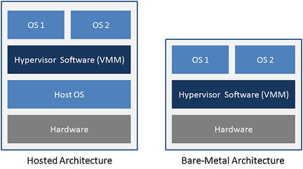

Các loại ảo hóa:
* Ảo hóa storage
* Ảo hóa hệ thống mạng
* Ảo hóa ứng dụng
* Ảo hóa hệ thống máy chủ

## Ảo hóa storage

Ảo hóa hệ thống lưu trữ về cơ bản là sự mô phỏng, giả lập việc lưu trữ từ các thiết bị vật lý. Giúp tăng tốc khả năng truy xuất dữ liệu.
Có 3 dạng mô hình sau
* **host-based**: Trong mô hình này, ngăn cách giữa lớp ảo hóa và ổ đĩa vật lý là driver điều khiển của các ổ đĩa. Phần mềm ảo hóa sẽ truy xuất tài nguyên (các ổ cứng vật lý) thông qua sự điều khiển và truy xuất của lớp Driver này.
* **Storage-device based**: Trong dạng này, phần mềm ảo hóa giao tiếp trực tiếp với ổ cứng. Ta có thể xem như đây là một dạng firmware đặc biêt, được cài trực tiếp vào ổ cứng. Dạng này cho phép truy xuất nhanh nhất tới ổ cứng, nhưng thiết lập sẽ khó khăn và phức tạp hơn. Dịch vụ ảo hóa được cung cấp cho các Server thông qua một thiết bị điều khiển gọi là Primary Storage Controller.
* **Network-based**:  Trong mô hình này, việc ảo hóa sẽ được thực thi trên một thiết bị mạng, ở đây có thể là một thiết bị switch hay một máy chủ. Các switch  hay máy chủ này kết nối với các trung tâm lưu trữ (SAN). Từ các switch hay server này, các ứng dụng kết nối vào được giao tiếp với trung tâm dữ liệu bằng các “ổ  cứng” mô phỏng do switch hay máy chủ tạo ra dựa trên  trung tâm dữ liệu thật. Đây cũng là mô hình hay gặp nhất trên thực tế.

## Ảo hóa hệ thống mạng

Là một tiến trình hợp nhất tài nguyên thiết bị mạng cả phần cứng lần phần mềm thành một hệ thống mạng ảo. Sau đó các tài nguyên này sẽ được phân chia thành các channel và gắn với một máy chủ hoặc một thiết bị nào đó.
Các phương pháp ảo hóa hệ thống mạng tùy thuộc vào thiết bị hỗ trợ, ngoài ra còn phụ thuộc vào hạ tầng mạng sẵn có, cũng như nhà cung cấp dịch vụ mạng (ISP).

* Ảo hóa lớp mạng (Virtualized overlay network): trong mô hình này, nhiều hệ thống mạng sẽ cùng tồn tại trên một lớp nền tài nguyên dùng chung. Các tài nguyên đó bao gồm các thiết bị mạng như router, switch, các dây truyền dẫn, NIC. Việc thiết lập nhiều hệ thống mạng ảo cho phép sự trao đổi thông suốt giữa các hệ thống mạng khác nhau, sử dụng các giao thức và phương diện truyền tải khác nhau, ví dụ như mạng Internet, hệ thống PSTN, hệ thống Voip.

* Mô hình ảo hóa của Cisco: đó là phân mô hình ảo hóa ra làm 3 khu vực, với các chức năng chuyên biệt. Mỗi khu vực sẽ có các liên kết với các khu vực khác để cung cấp các giải pháp đến tay người dùng 1 cách thông suốt:

    - Khu vực quản lý truy cập (Access Control): Có nhiệm vụ chứng thực người dùng muốn đăng nhập để sử dụng tài nguyên hệ thống, qua đó sẽ ngăn chặn các truy xuất không hợp lệ của người dùng; ngoài ra khu vực này còn kiểm tra, xác nhận và chứng thực việc truy xuất của người dùng trong vào các vùng hoạt động (như là VLan, Access list)
    - Khu vực đường dẫn (Path Isolation): Nhiệm vụ của khu vực này là duy trì  liên lạc thông qua tầng Network,  vận chuyển liên lạc giữa các vùng khác nhau trong hệ thống. Trong các vùng này sử dụng giao thức khác nhau, như MPLs và VRF, do đó cần một cầu nối để liên lạc giữa chúng. Ngoài  ra, khu vực này có  nhiệm vụ liên kết (maping) giữa các đường truyền dẫn với các vùng hoạt động ở  hai khu vực cạnh nó là Access Control và  services Edge.
    - Khu vực liên kết với dịch vụ (Services Edge): Tại đây sẽ áp dụng những chính sách phân quy ền, cũng như bảo mật ứng với từng vùng hoạt động cụ thể; đồng thời qua đó cung cấp quyền truy cập đến dịch vụ cho người dùng. Các dịch vụ có thể ở dạng chia sẻ hay phân tán, tùy thuộc vào môi trường phát triển ứng dụng và yêu cầu của người dung

## Ảo hóa ứng dụng 
Cho phép tách rời App-OS cho phép phân phối lại ứng dụng cho phù hợp với nhu cầu user (Citrix XemApp, Microsoft Application, Virtualization, VMware Thin App)
* Application stream: App được chia thành nhiều mã và được truyền sang máy người dùng khi cần đến. Thường sử dụng HTTP, CIFS hoặc RTSP
* Desktop Virtualization / Desktop Infrastructure: App được cài và chạy trên máy ảo, một hạ tầng quản lý sẽ tự động tạo ra các desktop ảo và cung cấp desktop đến các đối tượng sử dụng.
## Ảo hóa hệ thống máy chủ
* host-based: Sử dụng hypervisior chạy trên OS sử dụng dịch vụ đươc hệ điều hành cung cấp phân chia tài nguyên với máy ảo.Một số hệ thống hypervisor dạng Hosted có thể kể đến như VMware Server, VMware Workstation, Microsoft Virtual Server…

* Hypervisor-based:  hay còn gọi là bare-metal hypervisor. Chạy trực tiếp trên nền tảng phần cứng máy chủ. Các hypervisor này có khả năng điều khiển, kiểm soát phần cứng của máy chủ. Một số ví dụ về các hệ thống Bare-metal hypervisor như là Oracle  VM, VMware ESX Server, IBM's POWER Hypervisor, Microsoft's Hyper-V, Citrix XenServer…

