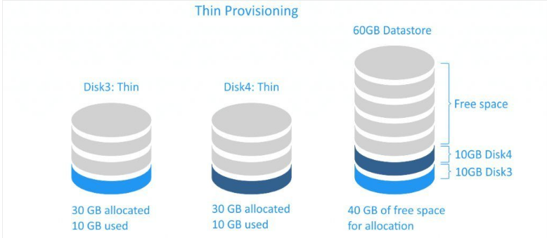

## Thick Provisioning
Là một loại phân bố lưu trữ trước, toàn bộ lưu lượng lưu trữ đĩa ảo được phân bố trước trên bộ lưu trữ vật lý khi đĩa ảo được tạo.
Một đĩa ảo sử dụng Thick Provisioning sẽ tiêu thụ tất cả không gian được phân bố cho kho dữ liệu ngay từ đầu, do đó, không gian này không có sẵn để sử dụng cho các máy ảo khác.
Có 2 loại Thick Provisioning
* **A Lazy zeroed disk** là đĩa chiếm toàn bộ dung lượng tại thời điểm tạo, nhưng không gian này có thể chứa một số dữ liệu cũ trên phương diện vật lý. Dữ liệu cũ này không bị xóa hoặc ghi, vì vậy nó cần được xóa trước khi dữ liệu mới có thể được ghi vào cuối khối. Loại này có thể được tạo nhanh hơn, nhưng hiệu suất của nó sẽ thấp hơn cho lần ghi đầu tiên do IOPS tăng (Hoạt động I/O mỗi giây) cho các khối mới.
* **An Eager zeroed disk** là đĩa có được tất cả không gian cần thiết tại thời điểm tạo và không gian xóa sạch mọi dữ liệu có trước đó trên phương diện vật lý. Việc tạo các Eager zeroed disk mất nhiều thời gian hơn, vì các số 0 được ghi vào toàn bộ đĩa, nhưng hiệu suất của chúng nhanh hơn trong lần ghi đầu tiên. Hỗ trợ tính năng phân cụm, chẳng hạn như khả năng chịu lỗi.

Vì lý do bảo mật dữ liệu, Eager phổ biến hơn so với Lazy đối với các đĩa ảo được cung cấp Thick Provisioning
Khi xóa VMDK, dữ liệu trên kho dữ liệu không bị xóa hoàn toàn; các khối được đánh dầu đơn giản là có sẵn, cho đến khi hệ điều hành ghi đè lên chúng. Nếu bạn tạo một đĩa ảo zeroed háo hức trên kho dữ liệu này, khu vực đĩa sẽ bị xóa hoàn toàn (tức zero), do đó ngăn bất kỳ ai có ý định xấu có thể khôi phục dữ liệu trước đó - ngay cả khi họ sử dụng phần mềm bên thứ ba chuyên dụng.

## Thin Provisioning
Là một phân bố trước lưu trữ, chỉ tiêu thụ dung lượng mà nó cần ban đầu và phát triển theo thời gian và theo nhu cầu.

Các đĩa ảo sử dụng Thin Provisioning rất nhanh để trạo và hữu ích để tiết kiệm không gian lưu trữ. Hiệu suất của một đĩa sử dụng Thin Provisioning không cao hơ so với Tick Provisioning, bởi vì đối với cả hai loại này, các số 0 phải được ghi trước khi dữ liệu vào mội khối mới.
Lưu ý khi xóa dữ liệu khi sử dụng Thin Provisioning, kích thước đĩa không tự động giảm. Điều này là do hện điều hành chỉ xóa các mục khỏi bảng tệp tham chiếu đến thân tệp trong hệ thống tệp. Đó là lý do vì sao khi xóa tệp rất nhanh (gần như ngay lập tức) vì nó không tốn thời gian để ghi các số 0.