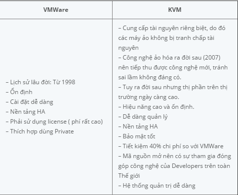
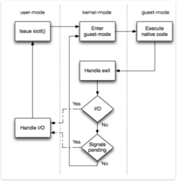
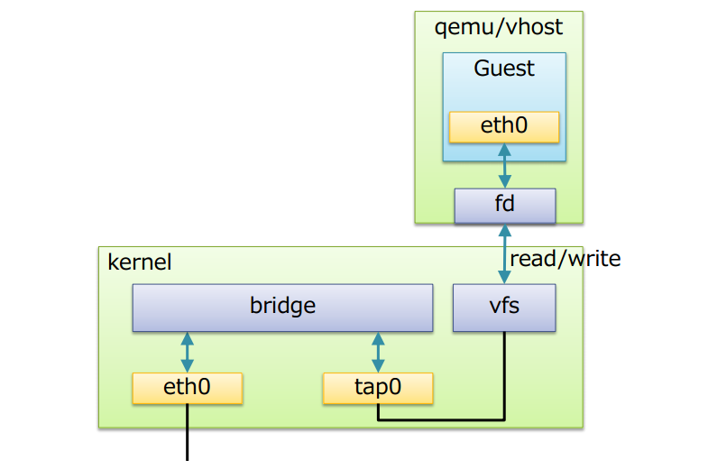

## 1. Khái niệm và vai trò

* KVM (Kernel-based virtual machine) là giải pháp ảo hóa cho hệ thống linux trên nền tảng phần cứng x86 có các module mở rộng hỗ trợ ảo hóa (Intel VT-x hoặc AMD-V). Về bản chất, KVM không thực sự là một hypervisor có chức năng giả lập phần cứng để chạy máy ảo. Chính xác KVM chỉ là một module của kernel linux hỗ trợ cơ chế mapping các chỉ dẫn đến CPU ảo (của guest VM) sang chỉ dẫn trên CPU vật lý (của máy chủ chứa VM). Hoặc có thể hình dung KVM giống như một driver cho hypervisor để sử dụng được tính năng ảo hóa của các vi xử lý như VT-x hay AMD-V, mục tiêu là tăng hiệu suất cho guest VM.
* Qumranet phát hành mã của KVM cho cộng đồng mã nguồn mở. Hiện nay,các công ty nổi tiếng như IBM, Intel và ADM cũng đã cộng tác với dự án. Từ phiên bản 2.6.20, KVM trở thành một phần của hạt nhân Linux.
* So sánh ưu điểm

## 2. Cấu trúc KVM

* Trong kiến trúc KVM, máy ảo là một tiến trình Linux, được lập lịch bởi chuẩn LInux scheduler. Trong thực tế, mỗi CPU ảo xuất hiện như là một tiến trình Linux. Điều này cho phép KVM sử dụng tất cả các tính năng của Linux kernel.
* Cấu trúc

* Linux có tất cả các cơ chế của một VMM cần thiết để vận hành các máy ảo. Chính vì vậy các nhà phát triển không xây dựng lại mà chỉ thêm vào đó một vài thành phần để hỗ trợ ảo hóa. KVM được triển khai như một module hạt nhân có thể được nạp vào để mở rộng Linux bởi những khả năng này.
* Trong một môi trường linux thông thường mỗi process chạy hoặc sử dụng user-mode hoặc kernel-mode. KVM đưa ra chế độ thứ 3, đó là guest-mode. Nó dựa trên CPU có khả năng ảo hóa với kiến trúc Intel VT hoặc AMD SVM ở một process trong guest-mode bao gồm cả kernel-mode và user-mode.
### 3 thành phần chính trong cấu trúc KVM
* KVM kernel module:  
    * Là một phần trong dòng chính của Linux kernel
    * Cung cấp giao diện chung cho IntelVMX và AMD SVM
    * Chứa các mô phỏng cho các instructions và CPU modes không được support bởi Intel VMX
* quemu -kmv: là chương trình dòng lệnh để thao tác các máy ảo, nhưng thường được vận chuyển dưới dạng các pakage "kvm" hoặc "quemu-kvm". Có 3 chức năng chính:
    * Thiết lập VM và các thiết bị vào ra (input/output)
    * Thực thi mã khách thông qua KVM kernel module
    * Mô phỏng các thiết bị ra vào và di chuyển các guest từ host này sang host khác.
* libvirt management stack
    * cung cấp API để các tool như virsh có thể giao tiếp và quản lý các VM
    * Cung cấp chế độ quản lý từ xa an toàn

## 3. Mô hình vận hành
Hình dưới đây mô tả mô hình vận hành của KVM. Đây là một vòng lặp của các hành động diễn ra để vận hành các máy ảo. Những hành động này được phân tách thành 3 phương thức: user-mode, kernel-mode, guest-mode.

Như ta thấy:
* User-mode: Các modul KVM gọi đến sử dụng ioclt() để thực thi mã khách cho đến khi hoạt động I/O khởi xướng bởi guest hoặc một sự kiện nào đó bên ngoài xảy ra. Sự kiện này có thể là sự xuất hiện của một gói tin mạng, cũng có thể là trả lời của một gói tin mạng được gửi bởi các máy chủ trước đó. Những sự kiện như vậy được biểu diễn như là tín hiệu dẫn đến sự gián đoạn của thực thi mã khách.
* Kernel-mode: Kernel làm phần cứng thực thi các mã khách tự nhiên. Nếu bộ xử lý thoát khỏi guest do cấp phát bộ nhớ hay I/O hoạt động, kernel thực hiện các nhiệm vụ cần thiết và tiếp tục luồng thực hiện, nếu các sự kiện bên ngoài như tín hiệu hoặc I/O hoạt động khởi xướng bởi các guest tồn tại, nó thoát tới user-mode
* Guest-mode: đây là cấp độ phần cứng, nới mà các lệnh mở rộng thiết lập của một CPU có khả năng ảo hóa được sử dụng để thực thi mã gốc, cho đến khi một lệnh được gọi như vậy cần sự hỗ trợ của KVM, một lỗi hoặc một gián đoạn từ bên ngoài.
Khi một máy ảo chạy, có rất nhiều chuyển đổi giữa các chế độ. Từ kernel-mode tới guest-mode tới guest-mode và ngược lại rất nhanh, bởi vì chỉ có mã nguồn gốc được thực hiện trên phần cứng cơ bản. KHi I/O họat đọng diễn ra các luồng thực thi tới user-mode, rất nhiều thiết bị ảo I/O được tạo ra, do vậy rất nhiều I/O thoát ra và chuyển sang chế độ user-mode chờ.
## 4. Cơ chế hoạt động
* Để các máy ảo giao tiếp được với nhaum KVM sử dụng Linux Bridge và OpenVSwitc, đây là 2 phần mềm cung cấp các giải pháp ảo hoá network. (Trong bài dưới đây sử dụng Linux Bridge).
* Linux bridge là một phần mềm được tích hợp vào trong nhân Linux để giải quyết vấn đề ảo hóa phần network trong các máy vật lý. Về mặt logic Linux bridge sẽ tạo ra một con switch ảo để cho các VM kết nối được vào và có thể nói chuyện trực tiếp với nhau cũng như sử dụng để ra mạng ngoài.
* Cấu trúc Linux Bridge khi kết hợp với KVM-QEMU

* Giải thích:
    *  Bridge: tương đương với switch layer 2
    *  Port: Tương đương với port của switch thật
    *  Tap (tab interface): Giao diện mạng để các VM kết nối với bridge do linux bridge tạo ra  
    *  fd(forward data): chuyển tiếp dữ liệu từ máy ảo tới bridge
* Các tính năng chính:
    * STP: Spanning tree Protocol
    * VLAN: Virtual LAN
    * FDB: Forwarding database.chuyển tiếp các gói tin theo database để nâng cao hiệu năng switch. Database lưu các địa chỉ MAC mà nó học được. Khi gói tin Ethernet đến, bridge sẽ tìm kiếm trong database có chứa MAC address không. Nếu không, nó sẽ gửi gói tin đến tất cả các cổng.

## 5. Tính năng

### Security
Trong KVM, máy ảo được xem như một tiến trình thông thường, nhờ đó tận dụng được mô hình bảo mật của hệ thống Linux như SELnux, cung cấp khả năng cô lập và kiểm soát tài nguyên. Bên cạnh đó còn có SVirt project - dự án cung cấp giải phát bảo mật MAC (Mandatory Access Control - Kiểm soát truy cập bắt buộc) tích hợp với hệ thống ảo hóa sử dụng SELinux để cung cấp một cơ sở hạ tầng cho phép người quản trị định nghĩa nên các chính sách để cô lập các máy ảo. Nghĩa là SVirt sẽ đảm bảo các tài nguyên của máy ảo không thể bị truy cập bởi bất kỳ kiến trình nào khác; việc này cũng có thể thay đổi bởi người quản trị hệ thống để đạt ra quyền hạn đặc biêt, nhóm các máy ảo với nhau chia sẻ chung tài nguyên.

### Memory management
KVM thừa kế tính năng quản lý bộ nhớ mạnh mẽ của Linux. Vùng nhớ của máy ảo được lưu trên một vùng nhớ dành cho các tiến trình Linux khác và có thể swap. KVM hỗ trợ NUMA (Non-Uniform Memory Access - bộ nhớ thiết kế cho hệ thống đa xử lý) cho phép tận dụng hiệu quả vùng nhớ kích thước lớn. KVM hỗ trợ các tính năng mới nhất từ các nhà cung cấp CPU như EPT(Extended Page Table) của Microsoft, Rapid Virtualization Indexing (RVI) của AMD để giảm thiểu mức độ sử dụng CPU và cho thông lượng cao hơn. KVM cũng hỗ trợ tính năng Memory page sharing bằng cách sử dụng tính năng của kernel là Kernel Same-page Merging (KSM)

### Storage
KVM có khả năng sử dụng bất kỳ giải phát lưu trữ nào hỗ trợ bởi Linux để lưu trữ các images để lưu trữ các Images của các máy ảo, bao gồm các ổ cục bộ như IDE, SCSI và SATA, Network Attached Storage (NAS) bao gồm NFS và SAMBA/CIFS, hoặc SAN thông qua các giao thức iSCSI và Fibre Channel. KVM tận dụng được các hệ thống lưu trữ tin cậy từ các nhà cung cấp hàng đầu trong lĩnh vực Storage. KVM cũng hỗ trợ các images của các máy ảo trên hệ thống tệp tin chia sẻ như GFS2 cho phép các images có thể được chia sẻ giữa nhiều host hoặc chia sẻ chung giữa các ổ logic.

### Live migration 
KVM hỗ trợ live migration cung cấp khả năng di chuyển các máy ảo đang chạy giữa các host vật lý mà không làm gián đoạn dịch vụ. Khả năng like migration là trong suốt với người dùng, các máy ảo vẫn duy trì trạng thái bật, kết nối mạng vẫn đảm bảo và các ứng dụng của người dùng vẫn tiếp tục duy trì trong khi máy ảo được đưa sang một host mật lý mới. Kvm cũng cho phép lưu lại trạng thái hiên tại của máy ảo để cho phép lưu trữ và khôi phục trạng thái đó vào lần sử dụng tiếp theo.

### Performance and scalability
KVM kế thừa hiệu năng và khả năng mở rộng của Linux, hỗ trợ máy ảo với 16 CPUs ảo, 256G RAm và hệ thống máy host lên tới 256 core và trên 1T RAm.

