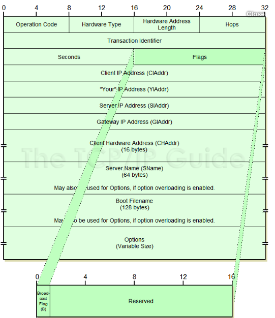
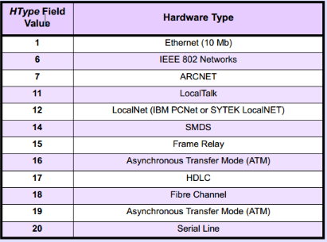
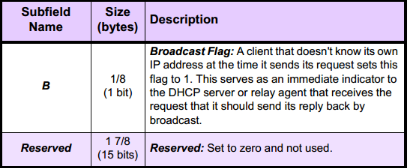

# DHCP Protocol

## Overview

DHCP (Dynamic Host Configuration Protocol) là một giao thức cho phép cấp phát địa chỉ IP một cách tự động cùng với các cấu hình liên quan như subnet mask, gateway mặc định và DNS. Nó cung cấp một database trung tâm để theo dõi tất cả các máy tính trong hệ thống mạng.

DHCP là phần mở rộng của Bootstrap Protocol(BOOTP).

## Các loại bản tin trong DHCP

* DHCP Discover
Đây là thông báo gửi đi từ phía máy trạm đến các máy chủ DHCP để xin cấp địa chỉ IP
* DHCP Offer
Đây là thông báo từ máy chủ DHCP gửi lại máy trạm để đưa ra một IP để máy trạm sử dụng (Ngoài IP có một số thông tin khác nữa)
* DHCP Request
Phía máy trạm sau khi lựa chọn được bản tin DHCP Offer gửi bản tin đến DHCP server đồng ý sử dụng các thông tin từ máy chủ gửi cho
* DHCP ACK
Máy chủ sau khi nhận được bản tin đồng ý sử dụng của máy trạm, DHCP gửi DHCP Pack đến client. Sau đó kết thúc quà trình cấp phát IP
* DHCP NACK
Broadcat bởi DHCP server tới DHCP client thông báo từ chối bản tin DHCP Request vì nó không còn giá trị nữa hoặc đã được sử dụng bởi một máy khác.
* DHCP Decline
Nếu máy trạm quyết định tham số thông tin được đề nghị nào không có giá trị, nó sẽ gửi gói tin DHCP Decline đến các Server. Và máy trạm bắt đầu tiến trình thuê bao lại.
* DHCP Release
DHCP client gửi tới DHCP server để từ bỏ địa chỉ IP và hợp đồng thuê còn lại.
* DHCP Inform
Gửi từ máy trạm đến máy chủ, yêu cầu các tham số cấu hình cục bộ bổ sung; máy chủ đã có một địa chỉ IP được cấu hình.

## Cấu trúc bản tin DHCP

Hình minh họa cho cấu trúc bản tin DHCP


*nguồn https://www.quora.com/How-does-DHCP-work-How-does-a-DHCP-server-send-messages-to-a-DHCP-client*

| Trường | Dung lượng | Mô tả|
|------- |-------|------|
| Opcode | 8 bits | Xác định loại message . Giá trị “1” là request message , “2” là reply message|
| Hardware type | 8 bits | Quy định cụ thể loại hardware.  |
| Hardware length | 8 bits | Quy định chiều dài của hardware address |
|Hop counts |8 bits|Set bằng “0” bởi client trước khi truyền request và được sử dụng bởi relay agent để control forwarding của BOOTP và DHCP messages .|
|Transaction Identifier	|32 bits|Được tạo bởi client, dùng để liên kết giữa request và replies của client và server.|
|Number of seconds |16 bits|được định nghĩa là số giây trôi qua kể từ khi client bắt đầu cố gắng để có được 1 IP hoặc thuê 1 IP mới . Điều này có thể được sử dụng khi DHCP Server bận , để sắp xếp thứ tự ưu tiên khi có nhiều request từ client chưa được giải quyết .|
|Flags |16 bits||
|Client IP address |32 bits|Client sẽ đặt IP của mình trong field này nếu và chỉ nếu nó đang có IP hay đang xin cấp lại IP, không thì mặc định = 0|
|Your IP address |32 bits|IP address được server cấp cho client|
|Server IP address |32 bits|IP address của Sever|
|Gateway IP address	|32 bits|Sử dụng trong relay agent|
|Client hardware address |16 bytes|Địa chỉ lớp 2 của client, dùng để định danh|
|Server host name |64 bytes|Khi DHCP server gửi DHCPOFFER hay DHCPACK thì sẽ đặt tên của nó vào trường này, nó có thể là “nickname” hoặc tên DNS domain|
|Boot filename |128 bytes|Option được sử dụng bởi client khi request 1 loại boot file trong DHCPDISCOVER message.  Được sử dụng bởi server trong DHCPOFFER để chỉ định path đến boot file directory và filename .|
|Options |Variable||


## Nguyên lý hoạt động

Hình minh họa cho quá trình


### Mô tả quá trình lấy IP với máy trạm lần đầu kết nối đến DHCP server
Quá trình lấy địa chỉ IP của máy trạm được mô tả như sau:

* Máy trạm khởi động với "IP rỗng" cho phép liên lạc với DHCP bằng giao thức UDP. Nó chuẩn bị một thông điệp (DHCP Discover) chứa địa chỉ MAC, tên máy tính.
Thông điệp DHCP Discover có IP nguồn: 0.0.0.0;
IP đích: 255.255.255.255; IP đã từng dùng

*DHCP Discover*
```
IP: ID = 0x0; Proto = UDP; Len: 328
    IP: Version = 4 (0x4)
    IP: Header Length = 20 (0x14)
    IP: Service Type = 0 (0x0)
        IP: Precedence = Routine
        IP: ...0.... = Normal Delay
        IP: ....0... = Normal Throughput
        IP: .....0.. = Normal Reliability
    IP: Total Length = 328 (0x148)
    IP: Identification = 0 (0x0)
    IP: Flags Summary = 0 (0x0)
        IP: .......0 = Last fragment in datagram
        IP: ......0. = May fragment datagram if necessary
    IP: Fragment Offset = 0 (0x0) bytes
    IP: Time to Live = 128 (0x80)
    IP: Protocol = UDP - User Datagram
    IP: Checksum = 0x39A6
    IP: Source Address = 0.0.0.0
    IP: Destination Address = 255.255.255.255
    IP: Data: Number of data bytes remaining = 308 (0x0134)

DHCP: Discover           (xid=21274A1D)
    DHCP: Op Code           (op)     = 1 (0x1)
    DHCP: Hardware Type     (htype)  = 1 (0x1) 10Mb Ethernet
    DHCP: Hardware Address Length (hlen) = 6 (0x6)
    DHCP: Hops              (hops)   = 0 (0x0)
    DHCP: Transaction ID    (xid)    = 556223005 (0x21274A1D)
    DHCP: Seconds           (secs)   = 0 (0x0)
    DHCP: Flags             (flags)  = 0 (0x0)
        DHCP: 0............... = No Broadcast
    DHCP: Client IP Address (ciaddr) = 0.0.0.0
    DHCP: Your   IP Address (yiaddr) = 0.0.0.0
    DHCP: Server IP Address (siaddr) = 0.0.0.0
    DHCP: Relay  IP Address (giaddr) = 0.0.0.0
    DHCP: Client Ethernet Address (chaddr) = 08002B2ED85E
    DHCP: Server Host Name  (sname)  = <Blank>
    DHCP: Boot File Name    (file)   = <Blank>
    DHCP: Magic Cookie = [OK]
    DHCP: Option Field      (options)
        DHCP: DHCP Message Type      = DHCP Discover
        DHCP: Client-identifier      = (Type: 1) 08 00 2b 2e d8 5e
        DHCP: Host Name              = JUMBO-WS
        DHCP: Parameter RequestUDP List = (Length: 7) 01 0f 03 2c 2e 2f 06
        DHCP: End of this option field
```
* Mọi máy chủ DHCP có thể nhận thông điệp và chuẩn bị IP cho máy trạm. Nếu có cấu hình phù hợp nó chuẩn bị thông điệp DHCP Offer chứa địa chỉ MAC của khách, địa chỉ IP đề nghị, subnet mask, địa chỉ IP máy chủ và thời gian cho thuê. Địa chỉ đề nghị được đánh dấu "reserve". Máy chủ DHCP phát tán thông tin này trên mạng. Với IP nguồn là IP máy chủ và IP đích là 255.255.255.255

*DHCP Offer*
```
IP: ID = 0x3C30; Proto = UDP; Len: 328
    IP: Version = 4 (0x4)
    IP: Header Length = 20 (0x14)
    IP: Service Type = 0 (0x0)
        IP: Precedence = Routine
        IP: ...0.... = Normal Delay
        IP: ....0... = Normal Throughput
        IP: .....0.. = Normal Reliability
    IP: Total Length = 328 (0x148)
    IP: Identification = 15408 (0x3C30)
    IP: Flags Summary = 0 (0x0)
        IP: .......0 = Last fragment in datagram
        IP: ......0. = May fragment datagram if necessary
    IP: Fragment Offset = 0 (0x0) bytes
    IP: Time to Live = 128 (0x80)
    IP: Protocol = UDP - User Datagram
    IP: Checksum = 0x2FA8
    IP: Source Address = 157.54.48.151
    IP: Destination Address = 255.255.255.255
    IP: Data: Number of data bytes remaining = 308 (0x0134)

DHCP: Offer              (xid=21274A1D)
    DHCP: Op Code           (op)     = 2 (0x2)
    DHCP: Hardware Type     (htype)  = 1 (0x1) 10Mb Ethernet
    DHCP: Hardware Address Length (hlen) = 6 (0x6)
    DHCP: Hops              (hops)   = 0 (0x0)
    DHCP: Transaction ID    (xid)    = 556223005 (0x21274A1D)
    DHCP: Seconds           (secs)   = 0 (0x0)
    DHCP: Flags             (flags)  = 0 (0x0)
        DHCP: 0............... = No Broadcast
    DHCP: Client IP Address (ciaddr) = 0.0.0.0
    DHCP: Your   IP Address (yiaddr) = 157.54.50.5
    DHCP: Server IP Address (siaddr) = 0.0.0.0
    DHCP: Relay  IP Address (giaddr) = 0.0.0.0
    DHCP: Client Ethernet Address (chaddr) = 08002B2ED85E
    DHCP: Server Host Name  (sname)  = <Blank>
    DHCP: Boot File Name    (file)   = <Blank>
    DHCP: Magic Cookie = [OK]
    DHCP: Option Field      (options)
        DHCP: DHCP Message Type      = DHCP Offer
        DHCP: Subnet Mask            = 255.255.240.0
        DHCP: Renewal Time Value (T1) = 8 Days,  0:00:00
        DHCP: Rebinding Time Value (T2) = 14 Days,  0:00:00
        DHCP: IP Address Lease Time  = 16 Days,  0:00:00
        DHCP: Server Identifier      = 157.54.48.151
        DHCP: Router                 = 157.54.48.1
        DHCP: NetBIOS Name Service   = 157.54.16.154
        DHCP: NetBIOS Node Type      = (Length: 1) 04
        DHCP: End of this option field
```

* Khi máy trạm nhận thông điệp đề nghị và chấp nhận một trong các địa chỉ IP, máy trạm phát tán thông điệp này để khẳng định nó đã chấp nhận địa chỉ IP. 

*DHCP Request*
```
IP: ID = 0x100; Proto = UDP; Len: 328
    IP: Version = 4 (0x4)
    IP: Header Length = 20 (0x14)
    IP: Service Type = 0 (0x0)
        IP: Precedence = Routine
        IP: ...0.... = Normal Delay
        IP: ....0... = Normal Throughput
        IP: .....0.. = Normal Reliability
    IP: Total Length = 328 (0x148)
    IP: Identification = 256 (0x100)
    IP: Flags Summary = 0 (0x0)
        IP: .......0 = Last fragment in datagram
        IP: ......0. = May fragment datagram if necessary
    IP: Fragment Offset = 0 (0x0) bytes
    IP: Time to Live = 128 (0x80)
    IP: Protocol = UDP - User Datagram
    IP: Checksum = 0x38A6
    IP: Source Address = 0.0.0.0
    IP: Destination Address = 255.255.255.255
    IP: Data: Number of data bytes remaining = 308 (0x0134)

DHCP: Request            (xid=21274A1D)
    DHCP: Op Code           (op)     = 1 (0x1)
    DHCP: Hardware Type     (htype)  = 1 (0x1) 10Mb Ethernet
    DHCP: Hardware Address Length (hlen) = 6 (0x6)
    DHCP: Hops              (hops)   = 0 (0x0)
    DHCP: Transaction ID    (xid)    = 556223005 (0x21274A1D)
    DHCP: Seconds           (secs)   = 0 (0x0)
    DHCP: Flags             (flags)  = 0 (0x0)
        DHCP: 0............... = No Broadcast
    DHCP: Client IP Address (ciaddr) = 0.0.0.0
    DHCP: Your   IP Address (yiaddr) = 0.0.0.0
    DHCP: Server IP Address (siaddr) = 0.0.0.0
    DHCP: Relay  IP Address (giaddr) = 0.0.0.0
    DHCP: Client Ethernet Address (chaddr) = 08002B2ED85E
    DHCP: Server Host Name  (sname)  = <Blank>
    DHCP: Boot File Name    (file)   = <Blank>
    DHCP: Magic Cookie = [OK]
    DHCP: Option Field      (options)
        DHCP: DHCP Message Type      = DHCP Request
        DHCP: Client-identifier      = (Type: 1) 08 00 2b 2e d8 5e
        DHCP: Requested Address      = 157.54.50.5
        DHCP: Server Identifier      = 157.54.48.151
        DHCP: Host Name              = JUMBO-WS
        DHCP: Parameter Request List = (Length: 7) 01 0f 03 2c 2e 2f 06
        DHCP: End of this option field
```
* Máy chủ phản hồi DHCP Request với DHCP Pack, hoàn tất cài đặt. Với địa chỉ nguồn vẫn là địa chỉ IP của máy chủ, địa chỉ đích là 255.255.255.255. Phần DHCP tùy chọn xác định gói là ACK

*DHCP Ack*
```
IP: ID = 0x3D30; Proto = UDP; Len: 328
    IP: Version = 4 (0x4)
    IP: Header Length = 20 (0x14)
    IP: Service Type = 0 (0x0)
        IP: Precedence = Routine
        IP: ...0.... = Normal Delay
        IP: ....0... = Normal Throughput
        IP: .....0.. = Normal Reliability
    IP: Total Length = 328 (0x148)
    IP: Identification = 15664 (0x3D30)
    IP: Flags Summary = 0 (0x0)
        IP: .......0 = Last fragment in datagram
        IP: ......0. = May fragment datagram if necessary
    IP: Fragment Offset = 0 (0x0) bytes
    IP: Time to Live = 128 (0x80)
    IP: Protocol = UDP - User Datagram
    IP: Checksum = 0x2EA8
    IP: Source Address = 157.54.48.151
    IP: Destination Address = 255.255.255.255
    IP: Data: Number of data bytes remaining = 308 (0x0134)

DHCP: ACK                (xid=21274A1D)
    DHCP: Op Code           (op)     = 2 (0x2)
    DHCP: Hardware Type     (htype)  = 1 (0x1) 10Mb Ethernet
    DHCP: Hardware Address Length (hlen) = 6 (0x6)
    DHCP: Hops              (hops)   = 0 (0x0)
    DHCP: Transaction ID    (xid)    = 556223005 (0x21274A1D)
    DHCP: Seconds           (secs)   = 0 (0x0)
    DHCP: Flags             (flags)  = 0 (0x0)
        DHCP: 0............... = No Broadcast
    DHCP: Client IP Address (ciaddr) = 0.0.0.0
    DHCP: Your   IP Address (yiaddr) = 157.54.50.5
    DHCP: Server IP Address (siaddr) = 0.0.0.0
    DHCP: Relay  IP Address (giaddr) = 0.0.0.0
    DHCP: Client Ethernet Address (chaddr) = 08002B2ED85E
    DHCP: Server Host Name  (sname)  = <Blank>
    DHCP: Boot File Name    (file)   = <Blank>
    DHCP: Magic Cookie = [OK]
    DHCP: Option Field      (options)
        DHCP: DHCP Message Type      = DHCP ACK
        DHCP: Renewal Time Value (T1) = 8 Days,  0:00:00
        DHCP: Rebinding Time Value (T2) = 14 Days,  0:00:00
        DHCP: IP Address Lease Time  = 16 Days,  0:00:00
        DHCP: Server Identifier      = 157.54.48.151
        DHCP: Subnet Mask            = 255.255.240.0
        DHCP: Router                 = 157.54.48.1
        DHCP: NetBIOS Name Service   = 157.54.16.154
        DHCP: NetBIOS Node Type      = (Length: 1) 04
        DHCP: End of this option field
```
### Mô tả quá trình lấy IP từ máy trạm đã từng kết nối đến DHCP server.

* Máy khách sẽ gửi bản tin DHCP Request đặc biệt. Trong đó có chứa địa chỉ IP máy trạm đã từng sử dụng.

*DHCP Request*
```
IP: ID = 0x0; Proto = UDP; Len: 328
    IP: Version = 4 (0x4)
    IP: Header Length = 20 (0x14)
    IP: Service Type = 0 (0x0)
        IP: Precedence = Routine
        IP: ...0.... = Normal Delay
        IP: ....0... = Normal Throughput
        IP: .....0.. = Normal Reliability
    IP: Total Length = 328 (0x148)
    IP: Identification = 0 (0x0)
    IP: Flags Summary = 0 (0x0)
        IP: .......0 = Last fragment in datagram
        IP: ......0. = May fragment datagram if necessary
    IP: Fragment Offset = 0 (0x0) bytes
    IP: Time to Live = 128 (0x80)
    IP: Protocol = UDP - User Datagram
    IP: Checksum = 0x39A6
    IP: Source Address = 0.0.0.0
    IP: Destination Address = 255.255.255.255
    IP: Data: Number of data bytes remaining = 308 (0x0134)

DHCP: Request            (xid=2757554E)
    DHCP: Op Code           (op)     = 1 (0x1)
    DHCP: Hardware Type     (htype)  = 1 (0x1) 10Mb Ethernet
    DHCP: Hardware Address Length (hlen) = 6 (0x6)
    DHCP: Hops              (hops)   = 0 (0x0)
    DHCP: Transaction ID    (xid)    = 660034894 (0x2757554E)
    DHCP: Seconds           (secs)   = 0 (0x0)
    DHCP: Flags             (flags)  = 0 (0x0)
        DHCP: 0............... = No Broadcast
    DHCP: Client IP Address (ciaddr) = 0.0.0.0
    DHCP: Your   IP Address (yiaddr) = 0.0.0.0
    DHCP: Server IP Address (siaddr) = 0.0.0.0
    DHCP: Relay  IP Address (giaddr) = 0.0.0.0
    DHCP: Client Ethernet Address (chaddr) = 08002B2ED85E
    DHCP: Server Host Name  (sname)  = <Blank>
    DHCP: Boot File Name    (file)   = <Blank>
    DHCP: Magic Cookie = [OK]
    DHCP: Option Field      (options)
        DHCP: DHCP Message Type      = DHCP Request
        DHCP: Client-identifier      = (Type: 1) 08 00 2b 2e d8 5e
        DHCP: Requested Address      = 157.54.50.5
        DHCP: Host Name              = JUMBO-WS
        DHCP: Parameter Request List = (Length: 7) 01 0f 03 2c 2e 2f 06
        DHCP: End of this option field
```
* Tại thời điểm này, nếu máy chủ còn địa chỉ IP đó chưa sử dụng, máy chủ sẽ gửi lại bản tin DCHP Pack đồng ý cho máy trạm sử dụng IP đó. Còn nếu máy chủ thấy rằng IP đó đã đc sử dụng, nó sẽ gửi một NACK đến máy trạm

*DHCP NACK*
```
IP: ID = 0x3F1A; Proto = UDP; Len: 328
    IP: Version = 4 (0x4)
    IP: Header Length = 20 (0x14)
    IP: Service Type = 0 (0x0)
        IP: Precedence = Routine
        IP: ...0.... = Normal Delay
        IP: ....0... = Normal Throughput
        IP: .....0.. = Normal Reliability
    IP: Total Length = 328 (0x148)
    IP: Identification = 16154 (0x3F1A)
    IP: Flags Summary = 0 (0x0)
        IP: .......0 = Last fragment in datagram
        IP: ......0. = May fragment datagram if necessary
    IP: Fragment Offset = 0 (0x0) bytes
    IP: Time to Live = 128 (0x80)
    IP: Protocol = UDP - User Datagram
    IP: Checksum = 0x2CBE
    IP: Source Address = 157.54.48.151
    IP: Destination Address = 255.255.255.255
    IP: Data: Number of data bytes remaining = 308 (0x0134)

DHCP: NACK               (xid=74A005CE)
    DHCP: Op Code           (op)     = 2 (0x2)
    DHCP: Hardware Type     (htype)  = 1 (0x1) 10Mb Ethernet
    DHCP: Hardware Address Length (hlen) = 6 (0x6)
    DHCP: Hops              (hops)   = 0 (0x0)
    DHCP: Transaction ID    (xid)    = 1956644302 (0x74A005CE)
    DHCP: Seconds           (secs)   = 0 (0x0)
    DHCP: Flags             (flags)  = 0 (0x0)
        DHCP: 0............... = No Broadcast
    DHCP: Client IP Address (ciaddr) = 0.0.0.0
    DHCP: Your   IP Address (yiaddr) = 0.0.0.0
    DHCP: Server IP Address (siaddr) = 0.0.0.0
    DHCP: Relay  IP Address (giaddr) = 0.0.0.0
    DHCP: Client Ethernet Address (chaddr) = 08002B2ED85E
    DHCP: Server Host Name  (sname)  = <Blank>
    DHCP: Boot File Name    (file)   = <Blank>
    DHCP: Magic Cookie = [OK]
    DHCP: Option Field      (options)
        DHCP: DHCP Message Type      = DHCP NACK
        DHCP: Server Identifier      = 157.54.48.151
        DHCP: End of this option field
```
* Máy trạm sau đó sẽ bắt đầu quá trình khám phá, những gói DHCP Disover vẫn sẽ cố gắng để thuê địa chỉ cũ.

*DHCP Disover*
```
IP: ID = 0x100; Proto = UDP; Len: 328
    IP: Version = 4 (0x4)
    IP: Header Length = 20 (0x14)
    IP: Service Type = 0 (0x0)
        IP: Precedence = Routine
        IP: ...0.... = Normal Delay
        IP: ....0... = Normal Throughput
        IP: .....0.. = Normal Reliability
    IP: Total Length = 328 (0x148)
    IP: Identification = 256 (0x100)
    IP: Flags Summary = 0 (0x0)
        IP: .......0 = Last fragment in datagram
        IP: ......0. = May fragment datagram if necessary
    IP: Fragment Offset = 0 (0x0) bytes
    IP: Time to Live = 128 (0x80)
    IP: Protocol = UDP - User Datagram
    IP: Checksum = 0x38A6
    IP: Source Address = 0.0.0.0
    IP: Destination Address = 255.255.255.255
    IP: Data: Number of data bytes remaining = 308 (0x0134)

DHCP: Discover           (xid=3ED14752)
    DHCP: Op Code           (op)     = 1 (0x1)
    DHCP: Hardware Type     (htype)  = 1 (0x1) 10Mb Ethernet
    DHCP: Hardware Address Length (hlen) = 6 (0x6)
    DHCP: Hops              (hops)   = 0 (0x0)
    DHCP: Transaction ID    (xid)    = 1053902674 (0x3ED14752)
    DHCP: Seconds           (secs)   = 0 (0x0)
    DHCP: Flags             (flags)  = 0 (0x0)
        DHCP: 0............... = No Broadcast
    DHCP: Client IP Address (ciaddr) = 0.0.0.0
    DHCP: Your   IP Address (yiaddr) = 0.0.0.0
    DHCP: Server IP Address (siaddr) = 0.0.0.0
    DHCP: Relay  IP Address (giaddr) = 0.0.0.0
    DHCP: Client Ethernet Address (chaddr) = 08002B2ED85E
    DHCP: Server Host Name  (sname)  = <Blank>
    DHCP: Boot File Name    (file)   = <Blank>
    DHCP: Magic Cookie = [OK]
    DHCP: Option Field      (options)
        DHCP: DHCP Message Type      = DHCP Discover
        DHCP: Client-identifier      = (Type: 1) 08 00 2b 2e d8 5e
        DHCP: Requested Address      = 157.54.51.5
        DHCP: Host Name              = JUMBO-WS
        DHCP: Parameter Request List = (Length: 7) 01 0f 03 2c 2e 2f 06
        DHCP: End of this option field
```

## Tổng kết

Bên trên là những tìm hiểu của tôi về giao thức DHCP, cảm ơn mọi người đã quan tâm.


