# Install CentOS in VMWare Workstation Pro 15

1. [Giới thiệu](#Overview)
2. [Cài đặt VMWare](https://websiteforstudents.com/how-to-install-vmware-workstation-pro-15-on-ubuntu-16-04-18-04-18-10/) 
3. [Khái quát cấu hình mở rộng của VMWare Workstation](#KhaiQuat)
4. [Cấu hình và cài đặt Centos 7](#Config)
5. [Tổng kết](#Note)

## Giới thiệu
**VMware Workstation** là một **phần mềm ảo hóa** desktop mạnh mẽ dành cho các nhà phát triển/kiểm tra phần mềm và các chuyên gia IT cần chạy nhiều HĐH một lúc trên một máy PC. Người dùng có thểchạy các HĐH Windows, Linux, Netware hay Solaris x86 trên các máy ảo di động mà không cần phải khởi động lại hay phân vùng ổcứng. VMware Workstation cung cấp khảnăng hoạt động tuyệt vời và nhiều tính năng mới như tối ưu hóa bộ nhớ và khả năng quản lý các thiết lập nhiều lớp. Các tính năng thiết yếu như mạng ảo, chụp ảnh nhanh trực tiếp, kéo thả, chia sẻ thư mục và hỗ trợ PXE khiến VMware Workstation trở thành công cụ mạnh mẽ và không thể thiếu cho các nhà doanh nghiệp phát triển tin họcvà các nhà quản trị hệ thống.

**VMware Workstation** họat động bằng cách cho phép nhiều HĐH và các ứng dụng của chúng chạy đồng thời trên một máy duy nhất. Các HĐH và ứng dụng này được tách ra vào trong các máy ảo. Những máy ảo này cùng tồn tại trên một phần cứng duy nhất. Các layer ảo của VMware sẽ kết nối các phần cứng vật lý với các máy ảo, do đó mỗi máy ảo sẽcó CPU, bộ nhớ, các ổ đĩa, thiết bị nhập/xuất riêng.

### Tính năng cho người dùng
* Thiết lập và thử nghiệm các ứng dụng đa lớp, cập nhật ứng dụng và các miếng vá cho HĐH chỉ trên một PC duy nhất.
* Dễ dàng phục hồi và chia sẻ các môi trường thử nghiệm được lưu trữ; giảm thiểu các thiết lập trùng lặp và thời gian thiết lập.
* Làm cho việc học tập trên máy tính thuận lợi hơn do sinh viên luôn đuợc sử dụng máy với tình trạng “sạch sẽ” và thử nghiệm với nhiều HĐH, ứng dụng cá các công cụ trên những máy ảo an toàn và độc lập.
* Chạy các bản demo phần mềm với các thiết lập phức tạp hoặc đa lớp trên một chiếc laptop.
* Tăng tốc độ giải quyết các rắc rối của người dùng cuối dựa trên một thư viện các máy ảo được thiết lập sẵn.

## Khái quát cấu hình mở rộng của VMWare Workstation

### Các hệ điều hành mới hỗ trợ VMware Workstation 15

* Windows 10 1803
* Ubuntu 18.04
* Fedora 28
* RHEL 7.5
* CentOS 7.5
* Debian 9.5
* OpenSuse Leap 15.0
* FreeBSD 11.2
* ESXi 6.7

## Cấu hình và cài đặt Centos 7

*Chuẩn bị file .iso của hệ điều hành Centos 7 [link tải](http://isoredirect.centos.org/centos/7/isos/x86_64/CentOS-7-x86_64-Minimal-1810.iso)*

* Sau khi đã cài đặt xong VMWare và Tải được file Iso của hệ điều hành Centos 7. Ta mở phần mềm VMWare lên

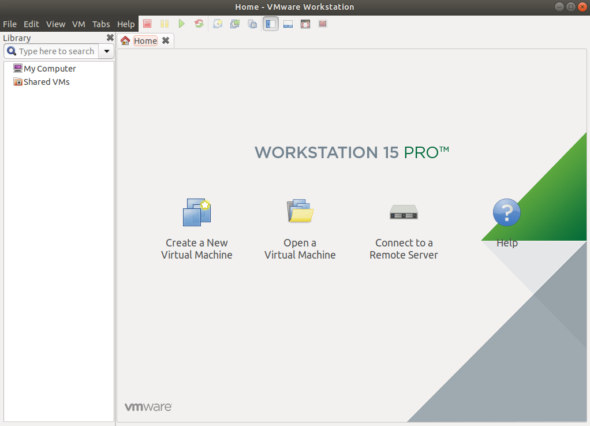

* Tại bảng này xuất hiện 2 sự lựa chọn là Typical và Custom. Chúng ta có thể chọn Custom để có thể cài đặt nâng cao như tùy chọn thêm về ổ cứng, card mạng, RAM. Và nếu muốn cài đặt chi tiết sau có thể chọn Typical.

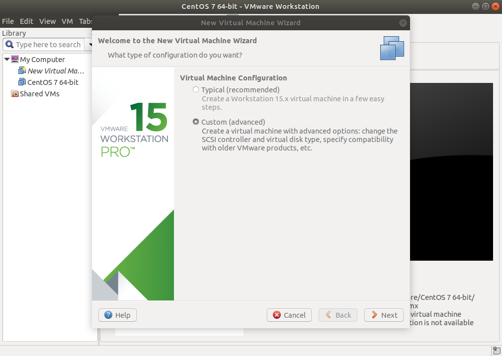

*  Sau đó có 3 lựa chọn **Use a physical drive** **Use ISO image** **I will install the operating system later**. Với sự lựa chọn đầu tiên, chúng ta có thể chọn vị trí ổ đĩa hoặc thiết bị ngoại vi có lưu trữ file cài đặt để chạy. Với sự lựa chọn thứ 2 chúng ta sẽ trỏ đến vị trí lưu file ISO trong máy.

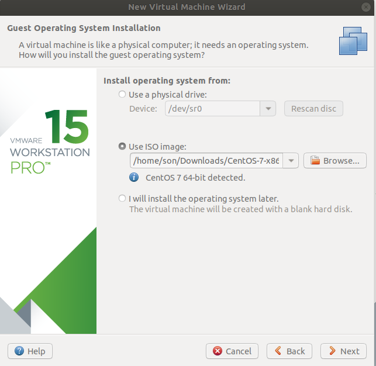

* Chọn loại hệ điều hành. Khi chúng ta chọn file ISO hệ thống sẽ biết được đó là OS nào và tự chọn phiên bản cho chúng ta. Nhưng chúng ta vẫn có thể lựa chọn loại OS khác. Nhưng chúng ta nên cài đúng OS chúng ta đã chọn.

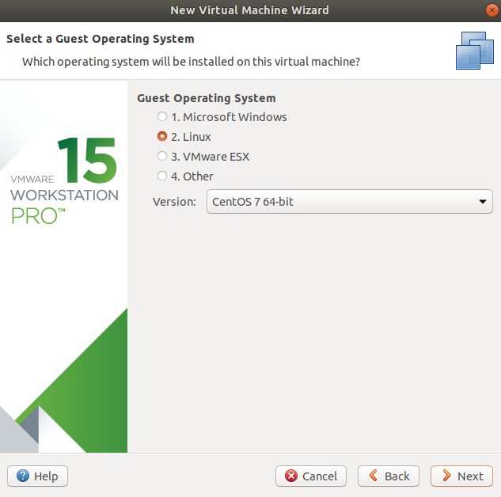

* Sau đó chúng ta có thể xem lại tên OS ảo và vị trí lưu của nó trên ổ cứng.

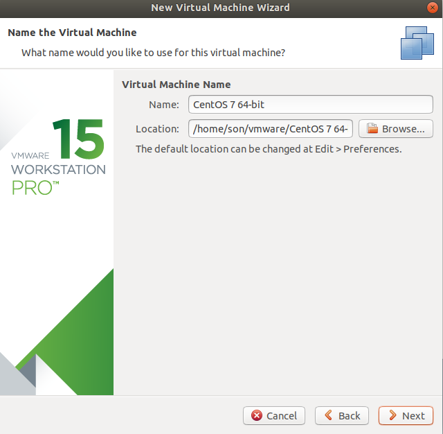

* Chọn kích thước ổ đĩa cho OS ảo. Với 2 lựa chọn **Store virtual disk as a single file** và **Store virtual disk as a multiple file** nghĩa là chúng ta có thể lựa chọn là nó lưu thành 1 file hay tách chúng ra thành nhiều file nhỏ

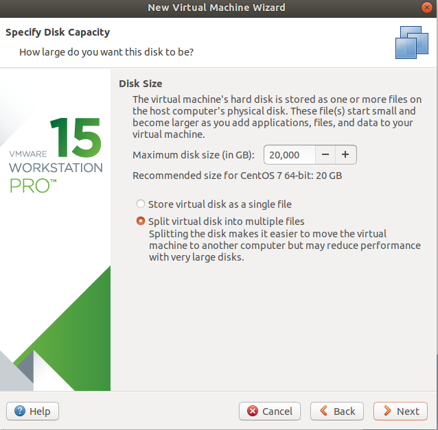

* Kết thúc xem lại cấu hình chúng ta có thể xem lại những cấu hình mà ta đã cài, chúng ta có thể thay đổi những cấu hình đó bằng button **Customize Hardware**. Tôi ví du như chúng ta có thể bỏ device CD/DVD và sound card đi. 
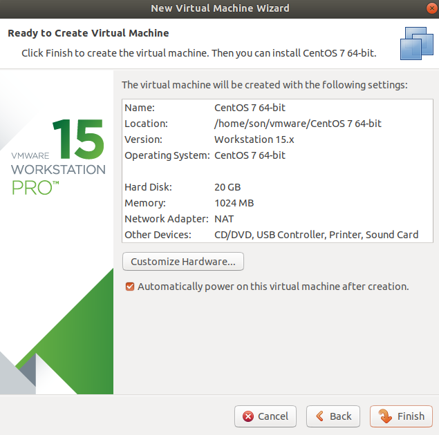

* Trỏ chuột đến device và ấn remove

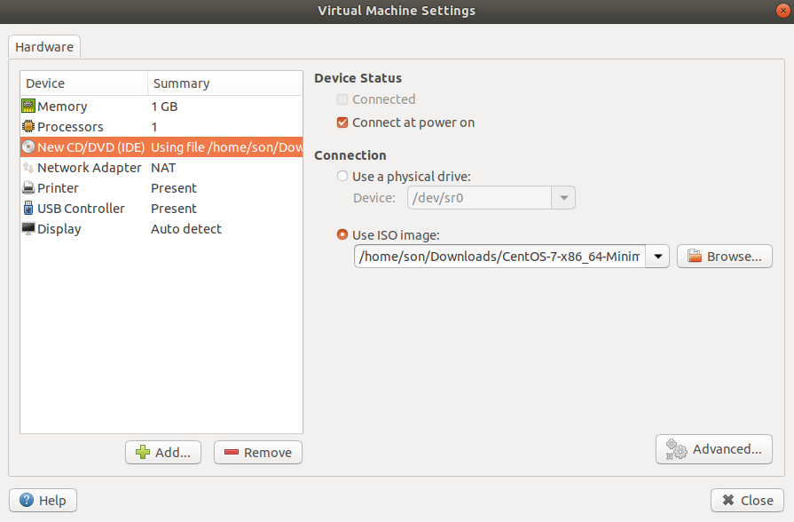

* Finish để bắt đầu cài đặt

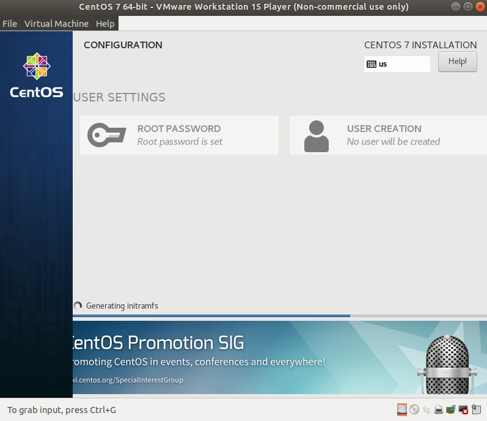

* Kết thúc cấu hình, khởi động vào Centos 7

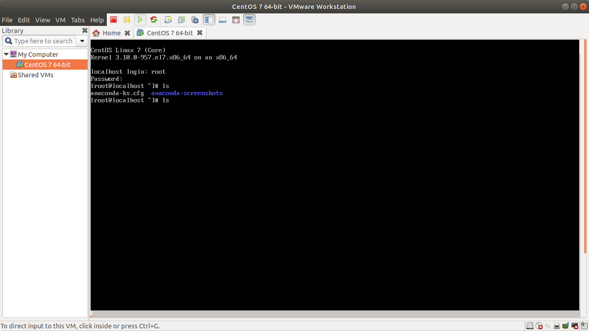

* Kiểm tra cấu hình

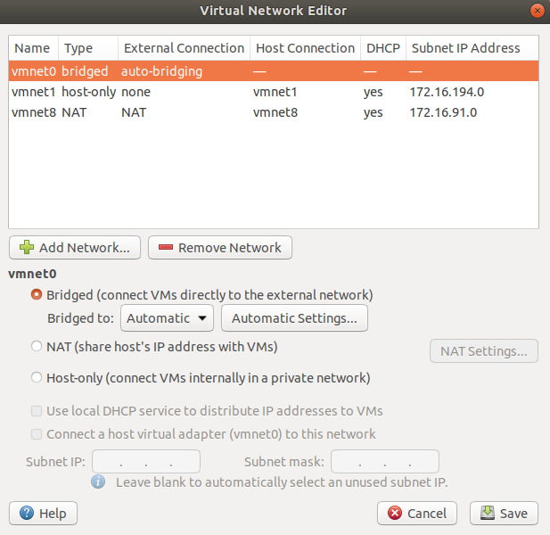

## Tổng kết

Kết thúc quá trình cài đặt và cấu hình máy ảo Centos 7 trên phần mềm VMWare Workstation Pro 15. 
