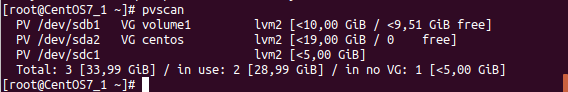

## Cấu trúc hệ thống tập tin

Trên nhiều hệ thống (gồm cả Linux), hệ thống tập tin được cấu trúc như một cái **cây**. Cây này thường được miêu tả đảo ngược bắt đầu từ thư mục **gốc**, đánh dấu sự khởi đầu của hệ thống tập tin phân quyền root cũng được ký hiệu là **/**.

Tiêu chuẩn phân cấp hệ thống tập tin (FHS) phát triển từ những phiên bản đầu tiên của UNIX. FHS cung cấp cho nhà phát triển và quản trị hệ thống Linux một cấu trúc thư mục tiêu chuẩn cho hệ thống tệp, cung cấp tính nhất quán giữa các hệ thống phân phối. Linux hỗ trợ các loại hệ thống tệp khác nhau được tạo cho Linux, cùng với các hệ thống tệp tương thích từ các hệ điều hành khác. Nhiều hệ thống tập tin cũ hơn được hỗ trợ. Một số ví dụ về các loại hệ thống tệp mà Linux hỗ trợ là:

1. ext3, ext4, btrfs, xfs (hệ thống tập tin Linux gốc)
2. vfat, ntfs, hfs (hệ thống tập tin từ các hệ điều hành khác)

Mỗi hệ thống tập tin nằm trên một phân vùng đĩa cứng. Các phân vùng giúp tổ chức nội dung của các đĩa theo loại dữ liệu chứa và cách sử dụng. Ví dụ, các chương trình quan trọng cần thiết để chạy hệ thống thường được giữ trên một phân vùng riêng biệt so với các chương trình có chứa các tệp thuộc sở hữu của người dùng thông thường. Ngoài ra, các tệp tạm thời được tạo và hủy trong quá trình hoạt động bình thường của Linux thường nằm trên một phân vùng riêng; theo cách này, sử dụng tất cả không gian có sẵn trên một phân vùng cụ thể có thể không ảnh hưởng nghiêm trọng đến hoạt động bình thường của hệ thống

`mount` lệnh được sử dụng để đính kèm một hệ thống tập tin ở đâu đó trong cây hệ thống tập tin. Đối sơ bao gồm nút thiết bị và điểm gắn kết

> $ mount /dev/sda5 /mnt

Điều này sẽ đính kèm hệ thống tập tin có trong phân vùng được liên kết với nút thiết bị /dev/sda5  vào cây hệ thống tập tin tại điểm gắn kết /mnt

> $ unmount /dev/sda5 /mnt 

*Chú ý*
* Các thiết bị không có mặt trong file /etc/fstab thì chỉ có roót mới có thể mount được.
* Người dùng bình thường chỉ có thể mount được những thiết bị có trong file /etc/fstab

## Thư mục Home

Trong bất kỳ hệ thống UNIX nào, mỗi người dùng có thư mục Home riêng của mình, thường được đặt tên là `/home`. Thư mục `/root` trên các hệ thống Linux hiện đại không nhiều hơn thư mục gốc của người dùng. Thư mục `/home`thường được gắn dưới dạng một hệ thống tệp riêng biệt trên phân vùng riêng hoặc thậm chí được xuất xứ xa trên mạng thông qua NFS.

## Các thư mục nhị phân

`/bin` thư mục chứa tập tin nhị phân thực thi, lệnh thiết yếu được sử dụng trong chế độ đơn người dùng, và các lệnh cần thiết theo yêu cầu của tất cả người dùng hệ thống. 
`/usr/bin` chứa các lệnh không cần thiết cho hệ thống ở chế độ một người dùng.
`/sbin` thưc mục được sử dụng cho các nhị phân thiết yếu liên quan đến quản trị hệ thống, chẳng hạn như ifconfig và shutdown.
`/usr/sbin` thư mục cho các chương trình quản trị hệ thống ít cần thiết hơn.

## Thư mục thiết bị

`/dev` chứa các nút thiết bị, một loại tệp giả được sử dụng bởi hầu hết các thiết bị phần cứng và phần mềm, ngoại trừ các thiết bị mạng. Thư mục này trống  trên phân vùng đĩa khi nó không được gắn nhưng nó vẫn chứa các mục được tạo bởi `udev` hệ thống, nó tạo và quản lý các nút thiết bị trên Linux, tạo chúng một cách linh hoạt khi tìm thấy thiết bị. Thư mục `/dev` chứa các thư mục như: 
> /dev/sda`
> /dev/lp1
> /dev/dvd1

## Thư mục biến

`/var/` chứa các tệp được dự kiến thay đổi kích thước và nội dung khi hệ thống đang chạy, chẳng hạn như các mục:
* `/var/log`
* `/var/lib` 
* `/var/spool`
* `/var/tmp`
* `/var/ftp`
* `/var/www`

`/var` có thể được đặt trong phân vùng riêng để sự tăng trưởng về kích thước tệp không ảnh hưởng nghiêm trọng đến hệ thống.

## Thư mục cấu hình hệ thống
`/etc` Chứa các tập tin cấu hình hệ thống. Nó không chứa các chương trình nhị phân mặc dù chứa một số tập lệnh thực thi.

## Thư mục khởi động

`/boot` Chứa một vài tập lệnh cần thiết để khởi động hệ thống
* `vmlinuz` là hạt nhân Linux được nén, cần thiết để khởi động
* `initramfs` là hệ thống tập tin ram ban đầu, cần thiết đề khởi động
* `config is` là tập tin cấu hình kernel, chỉ được sử dụng để gỡ lỗi
* `System.map` chứa bảng ký hiệu kernel, chỉ được sử dụng để gỡ lỗi

## Thư mục thư viện

`/lib` thư viện chứa mã nhúng được chia sẻ bởi các ứng dụng và cần thiết để chúng chạy cho các chương trình `/bin` và `/sbin`. Hầu hết trong số này là những gì được gọi là thư viện tải động. Trên một số bản Linux tồn tại môt  `/lib64` thư mục chứa các thư viện 64 bit, trong khi `/lib` có các phiên bản 32 bit. Các modul hạt nhân được đặt trong `lib/modules`

## Thư mục bổ sung

| Danh mục | Sử dụng |
|----------|---------|
| `opt` | Gói phần mềm ứng dụng tùy chọn |
| `sys` | Hệ thống tập tin giả ảo cung cấp thông tin về hệ thống và phần cứng. Có thể được sử dụng để thay đổi các tham số hệ thống và cho mục đích gỡ lỗi. |
| `/srv` | Dữ liệu cụ thể theo trang web được phục vụ bởi hệ thống. Ít khi sử dụng. |
| `/tmp` | Tập tin tạm thời, trên một số bản phân phối, các tệp này bị xóa trong quá trình khởi động lại |
| `/media` | Nó thường được đặt ở nơi có thể tháo rời phương tiện, như đía CD, DVD, và USB. Trừ khi cấu hình cấm nó, Linux sẽ tự động gắn phương tiện di động vào thư mục này khi chúng được phát hiện. |
| `/usr` | Ứng dụng, tiện ích và dư liệu đa người dùng.|
| `/usr/include` | Các tệp tiêu đề sử dụng để biên dịch các ứng dụng |
| `/usr/lib` | Thư viện cho các chương trình nhị phân.|
| `/usr/lib64` | Thư viện cho các chương trình nhị phân 64 bit. |
| `/usr/share` | Chia sẻ dữ liệu được sử dụng bởi các ứng dụng, thường không thụ thuộc vào kiến trúc|
| `/usr/src` | Source code, thường cho nhân Linux |
| `/usr/local` | Dữ liệu và chương trình cụ thể cho máy cục bộ. |

## Các lệnh làm việc với File system

### Giới thiệu về Partition

* Partition là những phân vùng nhỏ (phân vùng logic) được chia ra từ 1 ổ cứng vật lý. Mỗi ổ cứng có thể có 1 hoặc nhiều partition. Patition là cách phân chia và quản lý một ổ cứng đơn giản và hiệu quả.
* Dữ liệu trên một Partition sẽ được phân tách với dữ liệu trên partition khác, mọi thao tác trên partition này sẽ không ảnh hưởng đến partition kia (trừ khi ổ cứng chung bị hỏng)
* Hiện tại có 3 loại partition chính là: 
Primary partition: đây là những phân vùng có thể được dùng để boot hệ điều hành
Extended partition: là vùng dữ liệu còn lại khi ta đã phân chia ra các primary partition, extended partition chứa các logical partition trong đó. Mỗi một ổ đĩa chỉ có thể chứa 1 extended edition.
Logical partition: các phân vùng nhỏ nằm trong extended partition, thường dùng để chứa dữ liệu.

### MBR vs GPT

Thông tin về các partition của ổ cứng sẽ được lưu trên MBR (Master Boot Record) hoặc GPT (GUID Partition Table) tùy loại ổ cứng hỗ trợ. Đây là 2 chuẩn cấu hình và quản lý các partition trên ổ cứng. Thông tin được lưu trữ trên đây gồm vị trí và dung lượng của các partition.

#### MBR

MBR là chuẩn phân chia ổ đĩa truyền thống, một ổ đĩa sẽ được chia thành các vùng nhỏ với dung lượng bằng nhau là 512 bytes. Trên Linux, một ổ đĩa cứng được chia thành nhiều partition với số hiệu như sau: /dev/hda1, /dev/hda2, /dev/sda1, /dev/sda2, /dev/sdb1, ... Ta có thể dùng lệnh `fdisk` hoặc `parted` để hiển thị thông tin về ổ đĩa dùng MBR trên Linux.

Đối với các ổ cứng kiểu cũ chỉ hỗ trợ MBR thì ta chỉ được phép có tối đa 3 primary partition trên 1 ổ cứng, extended partition cũng được coi là 1 primary partition. Toàn bộ các thông tin về partition sẽ được lưu trữ ở 512 bytes đầu tiên trên ổ đĩa vật lý, sector này có tên là Master Boot Record.

#### GPT

GPT là chuẩn mới hơn, hỗ rợ đến 128 phân vùng trên một ổ đĩa vật lý. Thông tin về các partition sẽ được ghi thành nhiều bản rải rác khắp ổ vật lý. GPT hỗ trợ cơ chế kiểm tra và chỉnh sửa dữ liệu dựa trên CRC (cyclic redundancy check). Nhờ 2 cơ chế này, chuẩn GPT làm giảm tỷ lệ mất mát dữ liệu. Ngoài ra, nếu ta cần khởi tạo một phân vùng với dung lượng lớn hơn 2TB, ta sẽ phải dùng GPT vì MBR không hỗ trợ dung lượng lớn hơn 2 TB.

Ta có thể dùng lệnh `gdisk` hoặc `parted` để kiểm tra các ổ đĩa dùng GPT.

#### File system

Mỗi một partition sẽ cần có một filesystem riêng. Filesystem là cách thức lưu trữ và tìm kiếm dữ liệu trên một partition. Một số file system thông dụng được hỗ trợ trên Linux gồm:
* File system trên đĩa cứng ext2, ext3, ext 4 (hiện đang rất thông dụng trên các hệ điều hành mới), Btrfs, JFS, NTFS, xfs...
* File system trên thẻ nhớ flash: ubifs, JFFS2, YAFFS,...
* File system của các loại database.
* File system đặc biệt: procfs, sysfs, tmpfs, debugfs,...


### Thêm phân vùng mới vào Linux
Sau đây tôi xin giới thiệu các bước để thêm phân vùng mới vào hệ thống Linux.
Quy trình gồm các bước:
* Xác định chuẩn lưu thông tin về partition (MBR, GPT).
* Gắn một ổ cứng mới vào server.
* Chia partition cho ổ cứng.
* Khởi tạo file system (ext4, xfs...) cho partition vừa mới được tạo.
* Mount partition lên hệ thống.
* Cấu hình auto mount partition khi reboot

### Các lệnh với file system

`lsblk` : Kiểm tra các disk trên hệ thống
`fdisk` : Thực thi các lệnh thao tác với disk cùng các option

## Lab thêm disk vào máy ảo

### Thêm Disk

* Thêm 1 hoặc một số disk mới vào máy ảo.


Ấn save và reboot lại máy ảo

* Kiểm tra ổ disk mới đã được thêm vào hệ thống chưa với lệnh `lsblk`


ổ sdb là ổ mới được thêm vào.

* Tạo và định dạng LVM cho partition trên hard disk sử dụng lệnh `fdisk /dev/sdb`
Ấn m để xem hết tất cả các action có thể thực hiện


Tạo thêm partition mới bằng action `n`, sau đó chọn type `p` là primary, `e` là extended. Ở đây t chọn primary. Sau đó thay đổi định dạng partition bằng lệnh `fdisk /dev/sdb` sau đó chọn command `t` với đối số `8e` để định dạng ổ cứng về dạng `Linux LVM`.

* Tạo không gian vật lý 
Từ các partition đã tạo, sẽ tạo các Physical Volume trên đó bằng lệnh `pvcreate /dev/sdb1`


* Tạo Volume group

Sử dụng lệnh `vgcreate <tên group> /dev/sdb1 /dev/sdc1`
Sử dụng lệnh `vgs` hoặc `vgsdisplay` để kiểm tra lại.


* Tạo Logical Volume
Từ một Volume Group, chúng ta có thể tạo ra các Logical Volume bằng cách sử dụng lệnh:

`lvcreate -L 1G -n NewVolume volume1`


Sử dụng lệnh `lvs` hoặc `lvdisplay` để liệt kê các Logical Volume vừa tạo
* Định dạng Logical Volume vừa tạo
Có thể format các Logical Volume thành các định dạng như ext2, ext3, ext4, ...
```
mkfs.ext2 /dev/volume1/NewVolume
mkfs.ext3 /dev/volume1/NewVolume
mkfs.ext4 /dev/volume1/NewVolume
```


* Mount Logical Volume
Tạo thư mục mkdir /mnt/VolumeLogic1
Mount Logical Volume NewVolume vào thư mục vừa tạo bằng lệnh 
```
mount /dev/volume1/NewVolume /mnt/VolumeLogic1
```
sau đó kiểm tra lại bằng lệnh `df -h`


### Thay đổi dung lượng Logical Volume của LVM

Kiểm tra dung lượng 


Chung ta thấy 1 GB cho NewVolume là không đủ, và `volume1` vẫn còn nhiều dung lượng free, chúng ta có thể thay đổi dung lượng của nó bằng lệnh `lvextend -L +1GB /dev/volume1/NewVolume`
Sau khi tăng kích thước cho Logical Volume, info đã được thay đổi nhưng filesystem chưa thay đổi. Chúng ta cần resize filesystem.
```
resize2fs /dev/volume1/NewVolume


Còn đối với việc giảm kích thước Logical Volume
- Trước hết cần unmount logical volume `umount /dev/volume1/NewVolume`
- Tiến hành giảm kích thước của Logical Volume `lvreduce -L 500MB /dev/volume1/NewVolume`
- Format lại Logical Volume `mkfs.ext3 /dev/volume1/NewVolume`
- Mount lại Logical Volume `mount /dev/volume1/NewVolume /mnt/VolumeLogic1`
- df -h : kiểm tra mountpoint và dung lượng của nó.


### Thay đổi dung lượng Volume Group
Đầu tiên, chúng ta thêm một hard disk nữa vào máy ảo và reboot lại để hệ thống nhận thêm disk đó. Thao tác lại các lệnh tạo partition, tạo Physical Volume, Volume Group. 
Sau đó sử dụng lệnh `pvscan` để xem Physical Volume nào đang rảnh.



Ta thấy Physical Volume `dev/sdc1` vừa add vào đang rảnh. Ta muốn thêm `dev/sdc1` vào Volume Group volume1 sử dụng lệnh 
```
vgextend /dev/volume1 /dev/sdc1
```


### Xóa Logical Volume, Volume Group, Physical Volum

* Xóa Logical Volume
    * Trước hết phải unmount Logical Volume

```
umount /dev/volume1/NewVolume
```
Thực hiện xóa 

Logical Volume `lvremove /dev/volume1/NewVolume`

Volume Group `vgremove /dev/volume1`

Physical Volume `pvremove /dev/sdc1`