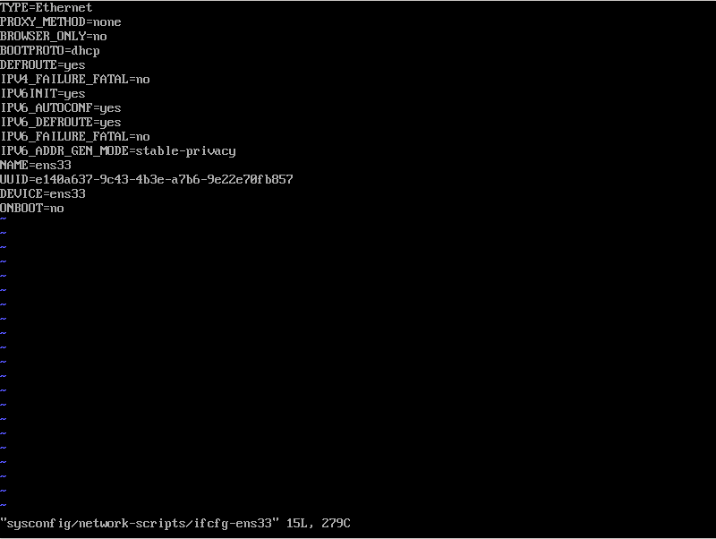
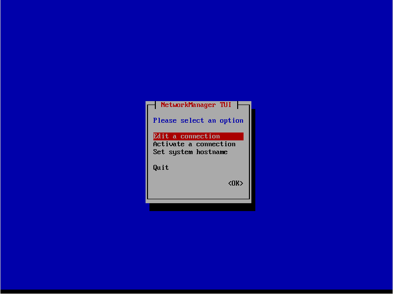
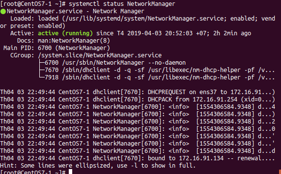

## Cấu hình mạng trên CentOS7

Trên CentOS7 để cấu hình mạng ethernet, chúng ta truy cập vào file `/etc/sysconfig/network-scipts/ifcfg-ens33`



Tại file này, chúng ta có thể sửa cấu hình mạng của CentOS.

Một cách khác để có thể cấu hình với giao diện thân thiện hơn là dùng lệnh `nmtui`



Tại file này, chúng ta có thẻ thay đổi cấu hình, lựa chọn đường mạng kết nối, đặt hostname.

## Lab Network Manager no Gui in CentOS 7

* Cài đặt NetworkManager
```
yum install NetworkManager
```

Kiểm tra service đã chạy chưa bằng lệnh `systemctl status NetworkManager`



Nếu dịch vụ chưa chạy, dùng lệnh `systemctl start NetworkManagera`
* Hướng dẫn sử dụng NetworkManager
Tải lại các cấu hình đã kết nối

```
nmcli connection reload
```
Để tải lại chỉ 1 tệp thay đổi (có thể chỉ định nhiều tệp)
```
nmcli con load /etc/sysconfig/network-scripts/ifcfg-ifname
```
Tắt kết nối tại 1 cổng
```
nmcli dev disconnect interface-name
```
Bật kết nối tại 1 cổng
```
nmcli con up interface-name
```


## Trên ubuntu 
Đặt static
Truy cập vào file `sudo nano /etc/netplan/50-cloud-init.yaml`

```
# This file is generated from information provided by
# the datasource.  Changes to it will not persist across an instance.
# To disable cloud-init's network configuration capabilities, write a file
# /etc/cloud/cloud.cfg.d/99-disable-network-config.cfg with the following:
# network: {config: disabled}
network:
    ethernets:
        enp0s3:
            addresses: [192.168.1.2/24]
            gateway4: 192.168.1.1
            nameservers:
              addresses: [8.8.8.8,8.8.4.4]
            dhcp4: no
    version: 2
```
