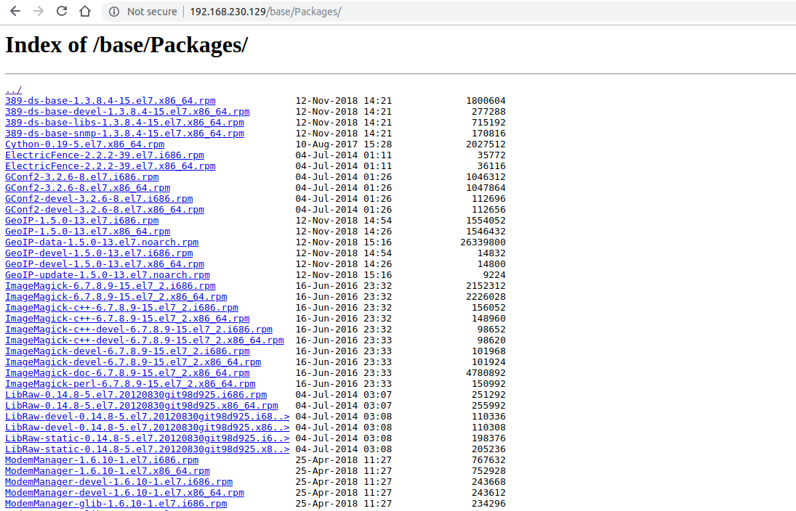
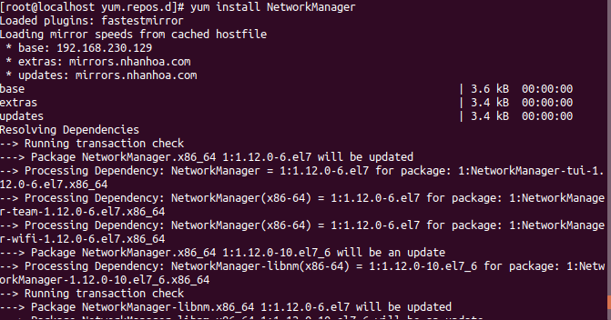

# Epel và Remi Repository

**EPEL** (Extra Packages for Enterpríe Linux) Là một dự án repository từ Fedora team cung cấp rất nhiều gói add-on package mà chúng ta thường dùng cho các bản Linux bao gồm CentOS, RHEL (Red Hat Enterprise Linux) và Scientific Linux.
**REMI** repository cũng là một repo miễn phí được sử dụng phổ biến.

## Cài đặt Epel Repo trên CentOS 7/6/5

**Cách 1:**
```
yum install epel-realease
```
Nếu không được hãy thử qua cách 2

**Cách 2:**
Với cách này, hãy chọn lệnh tương ứng với từng bản CentOS

Epel trên CentOS 7 64 bit
```
## CentOS/RHEL 7 64 bit ##
rpm -Uvh http://dl.fedoraproject.org/pub/epel/7/x86_64/e/epel-release-7-5.noarch.rpm
```

Epel trên CentOS 6 32-64 bit
```
## CentOS/RHEL 6 32 Bit (i386) ##
rpm -Uvh http://download.fedoraproject.org/pub/epel/6/i386/epel-release-6-8.noarch.rpm
 
## CentOS/RHEL 6 64 Bit x86_64) ##
rpm -Uvh http://download.fedoraproject.org/pub/epel/6/x86_64/epel-release-6-8.noarch.rpm
```

Epel trên CentOS 5 32-64 bit
```
## CentOS/RHEL 5 32 Bit (i386) ##
rpm -Uvh http://dl.fedoraproject.org/pub/epel/5/i386/epel-release-5-4.noarch.rpm
 
## CentOS/RHEL 5 64 Bit (x86_64) ##
rpm -Uvh http://dl.fedoraproject.org/pub/epel/5/x86_64/epel-release-5-4.noarch.rpm
```

## Cài đặt REMI Repo trên CentOS 7/6/5

REMI trên CentOS 7
```
## CentOS/RHEL 7 ##
rpm -Uvh http://rpms.famillecollet.com/enterprise/remi-release-7.rpm
```

REMI trên CentOS 6
```
## CentOS/RHEL 6 ##
rpm -Uvh http://rpms.famillecollet.com/enterprise/remi-release-6.rpm
```

REMI trên CentOS 5
```
## CentOS/RHEL 5 ##
rpm -Uvh http://rpms.famillecollet.com/enterprise/remi-release-5.rpm
```

## Kiểm tra Repo 
Kiểm tra repo đang được enable
```
yum repolist
```
Kiểm tra repo đang được disable
```
yum repolist disable
```

## Hướng dẫn xóa Yum repo
Đôi khi một số repo bị lỗi, không sử dụng được. Làm thế nào để xóa hoặc disable repo này đi?
Các file yum repo được lưu ở `/etc/yum.repo.d/`

Tìm kiếm chính xác tên repo
```
rpm -qa | grep -i repo-name
```

Xóa repo
```
rpm -e repo-name
```

Nếu không tìm thấy hãy xóa trực tiếp file .repo hoặc đổi tên file
```
rm /etc/yum.repos.d/epel.repo

##OR rename##
mv /etc/yum.repos.d/repo-file.repo /etc/yum.repos.d/repo-file.repo.bak
```

## Disable Yum repo

```
yum -- disablerepo=some-repository install some-package
```
## Lab setup repo local
https://www.tecmint.com/setup-local-http-yum-repository-on-centos-7/
* Cài Nginx server
* Bật service, tắt tường lửa (hoặc mở cổng kết nối tới nginx)
```
firewall-cmd --zone=public --permanent --add-service=http
firewall-cmd --zone=public --permanent --add-service=https
firewall-cmd --reload
```
* Create yum local repository
```
yum install createrepo  yum-utils
```
Tạo các file base, centoslpus, extras, updates
```
mkdir -p /var/www/html/repos/{base,centosplus,extras,updates}
```
Tải các gói đồng bộ về local
```
reposync -g -l -d -m --repoid=base --newest-only --download-metadata --download_path=/var/www/html/repos/
reposync -g -l -d -m --repoid=centosplus --newest-only --download-metadata --download_path=/var/www/html/repos/
reposync -g -l -d -m --repoid=extras --newest-only --download-metadata --download_path=/var/www/html/repos/
reposync -g -l -d -m --repoid=updates --newest-only --download-metadata --download_path=/var/www/html/repos/
```
Với các thông số
```
-g - cho phép loại bỏ các gói không kiểm tra chữ ký GPG sau khi tải xuống.
-l - cho phép hỗ trợ plugin yum.
-d - cho phép xóa các gói cục bộ không còn trong kho lưu trữ.
-m- cho phép tải xuống các tệp comps.xml .
--repoid - chỉ định ID kho lưu trữ.
--newest-only - nói với reposync để chỉ kéo phiên bản mới nhất của mỗi gói trong repos.
--download-metadata - cho phép tải xuống tất cả các siêu dữ liệu không mặc định.
--download_path - chỉ định đường dẫn để tải xuống các gói.
```

Tạo repodata mới cho các kho lưu trữ cục bộ bằng lệnh
```
createrepo -g comps.xml /var/www/html/repos/base/  
createrepo -g comps.xml /var/www/html/repos/centosplus/	
createrepo -g comps.xml /var/www/html/repos/extras/  
createrepo -g comps.xml /var/www/html/repos/updates/ 
```
Trỏ vào file lưu trữ
```
vim /etc/nginx/conf.d/repose.conf 
```
thêm cấu hình

```
server {
        listen   80;
        server_name  <your local>;	#change  test.lab to your real domain 
        root   /var/www/html/repos;
        location / {
                index  index.php index.html index.htm;
                autoindex on;	#enable listing of directory index
        }
}
```



* Cài đặt local yum repo trên client
Trên máy client (CentOS 7), vào file `/etc/yum.repos.d/CentOS-Base.repo`
Thêm dòng vào 
```
baseurl=http://192.168.230.129/base
```
vào trường `[base]`
Thử install 1 gói



*Chú ý* : Disable SELinux để có thể load được các file .rpm lên nginx.


