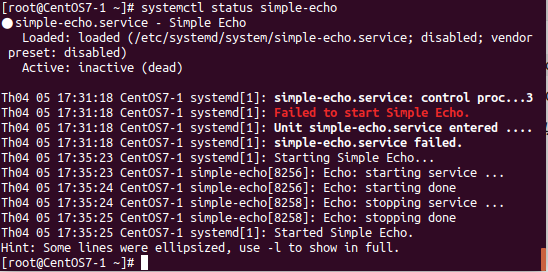

## Khái niệm
Service là một dịch vụ chạy trên máy từ lúc bật cho đến lúc tắt(bật, tắt, khởi động lại,...).
Đại diện cho nó là `Systemd`
Systemd quản lý các unit
Mỗi unit được cấu hình trong một unit file, thường nằm trong thư mục:
`etc/systemd/system` : các file config do người dùng thêm
`lib/systemd/system`: Các unit file do các phần mềm cài vào (vd cài Nginx, nếu package Nginx có chứa file unit thì nó sẽ được cho vào đây.)
`run/systemd/system` : runtime unit
Có 12 loại unit khác nhau:
* service : các file quản lý hoạt động của một số chương trình
* Socket : Quản lý các kết nối
* Device : Quản lý các thiết bị
* mount : Gắn thiết bị
* automount : tự động gắn thiết bị
* swap : vùng không gian bộ nhớ trên đĩa cứng
* target : quản lý tạo liên kết
* path : quản lý các đường dẫn
* timer : dùng cho cron-job để lập lịch
* snapshot: sao lưu
* slice : dùng cho quản lý tiến trình
* scope : Quy định không hoạt độngình

Nhưng ta chỉ quan tâm đến loại `service`, là unit sẽ quản lý một chương trình khởi động khi bật máy và luôn luôn chạy ở chế độ nền (background) và được gọi là deamon.
## Systemctl 
Systemctl là câu lệnh để giám sát và điều khiển systemd, cụ thể sẽ tương tác với các unit.

* Liệt kê các unit đã được load
`systemctl list-units | tail -n2 ` (option `-n2` chỉ để xem 2 dòng cuối)
`systemctl -t service | head -n3` (option `-n3` để xem 3 dòng đâu`) 

* Hiển thị trạng thái hệ thống
`systemctl status`

* Điều khiển một service
`systemctl start <name service>`
`systemctl stop <name service>`
`systemctl status <name service>`
`systemctl restart <name service>`
`systemctl reload <name service>` (yêu cầu service load lại config)

* Bật service khởi động cùng máy
`systemctl enable <service name>`:câu lệnh kích hoạt service như một daemon-service
`systemctl disable <service name    >` : xóa syslink service daemon đã tạo khi enable service

## Khởi tạo một service
Tạo một file cấu hình đơn giản trong `/etc/systemd/system`
```
# Location: /etc/systemd/system/simple-echo.service
[Unit]
Description=Simple Echo

[Service]
Type = forking
ExecStart = /usr/local/bin/simple-echo start
ExecStop = /usr/local/bin/simple-echo stop
ExecReload = /usr/local/bin/simple-echo restart

[Install]
WantedBy = multi-user.target
```
Và tạo file thực thi dịch vụ
```
#!/bin/bash
# Location: /usr/local/bin/simple-echo

function echo_start () {
  echo "Echo: starting service ..."
  sleep 1
  echo "Echo: starting done"
}

function echo_stop () {
  echo "Echo: stopping service ..."
  sleep 1
  echo "Echo: stopping done"
}

function echo_status () {
  echo "Echo service"
}

case "$1" in
  'start')
    echo_start
    ;;
  'stop')
    echo_stop
    ;;
  'restart')
    echo_start
    sleep 1
    echo_stop
    ;;
  'status')
    echo_status
    ;;
  *)
    echo "Usage: $0 {start|stop|status|restart}" >&2
    ;;
esac
```
Kết quả thu được khi chạy dịch vụ và kiểm tra


<https://www.freedesktop.org/software/systemd/man/systemd.service.html#>