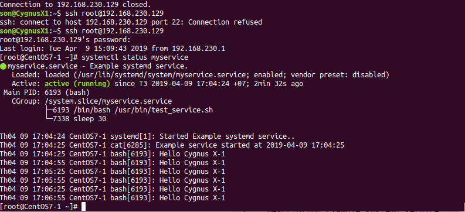

## Khái niệm

Service là một dịch vụ chạy trên máy từ lúc bật cho đến lúc tắt(bật, tắt, khởi động lại,...).
Đại diện cho nó là `Systemd`
Systemd quản lý các unit
* Tất cả các chương trình được quản lý bởi systemd đều được thực thi dưới background và được cấu hình thành 1 file config gọi là Unit file. Đây là những điều cơ bản và đại diện tiêu chuẩn hóa cho các tài nguyên hệ thống có thể được quản lý bởi deamon và thao túng bởi các tiện ích được cung cấp.

Mỗi unit được cấu hình trong một unit file, thường nằm trong thư mục:
`etc/systemd/system` : các file config do người dùng thêm
`lib/systemd/system`: Các unit file do các phần mềm cài vào (vd cài Nginx, nếu package Nginx có chứa file unit thì nó sẽ được cho vào đây.)
`run/systemd/system` : runtime unit
Có 12 loại unit khác nhau:
* service : các file quản lý hoạt động của một số chương trình
* Socket : Quản lý các kết nối
* Device : Quản lý các thiết bị
* mount : Gắn thiết bị
* automount : tự động gắn thiết bị
* swap : vùng không gian bộ nhớ trên đĩa cứng
* target : quản lý tạo liên kết
* path : quản lý các đường dẫn
* timer : dùng cho cron-job để lập lịch
* snapshot: sao lưu
* slice : dùng cho quản lý tiến trình
* scope : Quy định không hoạt độngình

Nhưng ta chỉ quan tâm đến loại `service`, là unit sẽ quản lý một chương trình khởi động khi bật máy và luôn luôn chạy ở chế độ nền (background) và được gọi là deamon.
## Các danh mục

| Danh mục | Sự miêu tả |
|----------|------------|
|/usr/lib/systemd/system/| Các tập tin đơn vị được phân phối với các gói cài đặt. Không sửa đổi tệp tin đơn vị tại vị trí này|
|/run/systemd/system/| các tập tin đơn vị được tạo động khi chạy. Thay đổi trong thư mục này bị mất khi khởi động lại|
|/etc/systemd/system/| Các tệp đơn vị được tạo bởi systemctl cho phép các tệp đơn vị tùy chỉnh được tạo bởi quản trị viên hệ thống|

## Systemctl 
Systemctl là câu lệnh để giám sát và điều khiển systemd, cụ thể sẽ tương tác với các unit.

* Liệt kê các unit đã được load
`systemctl list-units | tail -n2 ` (option `-n2` chỉ để xem 2 dòng cuối)
`systemctl -t service | head -n3` (option `-n3` để xem 3 dòng đâu`) 

* Hiển thị trạng thái hệ thống
`systemctl status`

* Điều khiển một service
`systemctl start <name service>`
`systemctl stop <name service>`
`systemctl status <name service>`
`systemctl restart <name service>`
`systemctl reload <name service>` (yêu cầu service load lại config)

* Bật service khởi động cùng máy
`systemctl enable <service name>`:câu lệnh kích hoạt service như một daemon-service
`systemctl disable <service name    >` : xóa syslink service daemon đã tạo khi enable service

## Khởi tạo một service

Tạo file thực thi dịch vụ trong `/usr/bin` và cấp quyền thực thi cho file.

```
DATE=`date '+%Y-%m-%d %H:%M:%S'`
echo "Example service started at ${DATE}" | systemd-cat -p info

while :
do
echo "Hello Cygnus X-1";
sleep 30;
done
```

Tạo một file cấu hình đơn giản trong `/lib/systemd/system/myservice.service`
```
[Unit]
Description=Example systemd service.

[Service]
Type=simple
ExecStart=/bin/bash /usr/bin/test_service.sh

[Install]
WantedBy=multi-user.targett
```
Bật dịch vụ và cho dịch vụ chạy cùng hệ thống khi khởi động bằng lệnh
```
systemctl start myservice
systemctl enable myservice
```

Kết quả thu được khi chạy dịch vụ và kiểm tra



Tham khảo

<https://www.freedesktop.org/software/systemd/man/systemd.service.html#>

<https://mangmaytinh.net/threads/understanding-systemd-units-and-unit-files.243/>