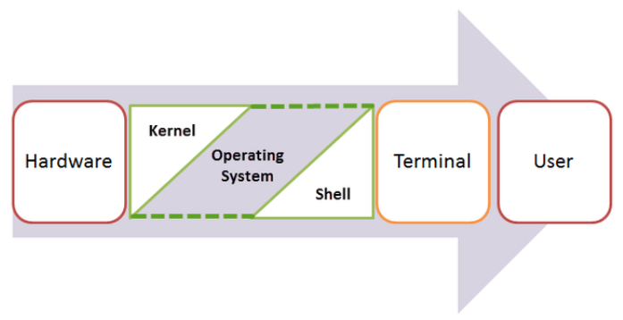

# Bash Shell

* SHELL (hệ vỏ) là một interface nằm giữa OS Kernel và người dùng, nó cung cấp môi trường để người dùng thao tác với Kernel. Các chương trình Shell sẽ làm nhiệm vụ thông dịch (interpret) các lệnh của người dùng sang chương trình có sẵn trên hệ thống từ đó thực thi các chức năng tương ứng. Các lệnh này người dùng có thể nhập trực tiếp qua chế độ tương tác (interactive) hoặc thông qua dạng script. Các Shell script sẽ được thông dịch (chứ không phải biên dịch - compile).
* BASH (Bourne Again Shell) thuộc nhóm Bourne Shell được viết bởi Brian Fox trong khuôn khổ một dự án của GNU cho việc thay thế sh.
Trên các hệ thống thì `/bin/sh` sẽ được symbolic link tới bash (có một số hệ thống như Ubuntu, Debian thì link tới dash (Debian AllShell), một dạng shell rút gọn, nhỏ cho thao tác non-interactive nhanh hơn)



## Bash's Configuration Files

Trong thưc mục có 3 file có ý nghĩa đặc biết với bash, cho phép bạn tự động set up môi trường khi bạn log in và gọi tới Bash shell khác, và cho bạn thực thi câu lệnh khi bạn log out. Bash mặc định `/etc/profile`
* `.bash_profile` đọc và thực hiện các lệnh trong nó mỗi khi đăng nhập hệ thống
* `.bashrc` Đọc và thực hiện mỗi khi bắt đầu một subshell
* `.bash_logout` đọc và thực hiện mỗi lần thoát khỏi shell

Bash cho phép có thể tồn tại 2 file khác tương tự như .bash_profile là : .bash_login và .profile. Mỗi khi login thì chỉ có 1 file được đọc. Nếu không có file .bash_profile thì nó sẽ tìm file .bash_login. Nếu file .bash_login cũng không có thì nó mới tìm tới file .profile. Trong trường hợp bạn muốn thực thi lệnh nào đó bất kể bạn đăng nhập hay không đăng nhập thì bạn có thể thêm nó vào file .bashrc.

Sửa đổi 1 file cấu hình chúng ta dùng lệnh
```
source file
or
source .file
```
## Interactive shells

Là bất kì quá trình nào bạn sử dụng để nhập lệnh và lấy kết quả đầu ra từ các lệnh đó. Do đó log in shell là interactive. Ngược lại, khi bạn chạy một kịch bản, một non-interactive được bắt đầu cái mà sẽ chạy những lệnh trong kịch bản đó và sau đó thoát nó khi đã xong.

* Với mỗi loại thì chúng sẽ đọc tệp startup file là khác nhau (/etc/profile, /etc/bashrc, ~/.bash_profile, ~/.bashrc, ...)

## Aliases

Một alias có thể hiểu nôm na là một chuỗi được thay thế cho một dòng lệnh hoặc một cụm dòng lệnh.
Ví dụ:
```
alias gitpull="git pull origin master"
```
Thay vì phải gõ 
```
git pull origin master
```
Thì ta có thể gõ
```
gitpull
```
Hoặc có thể lồng nhiều `alias` vào một `alias`

Ví dụ:
```
alias a1="command 1"
alias a2="command 2"
alias a3="command 3"
alias a4="command 4"
alias a="a1;a2;a3;a4 ..."

## Các lệnh cơ bản với Bash
<http://www.tldp.org/LDP/Bash-Beginners-Guide/html/>