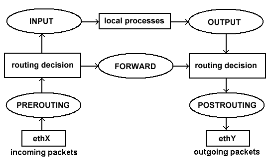
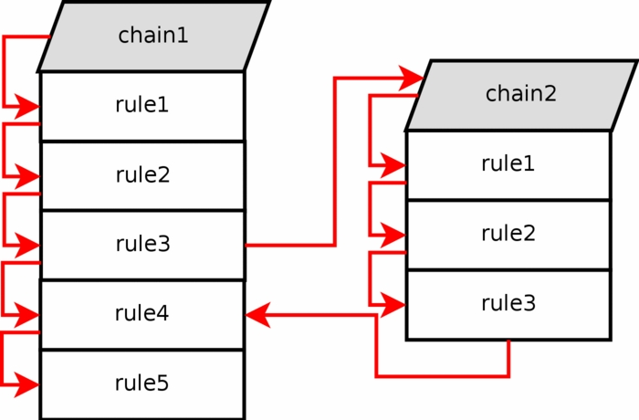
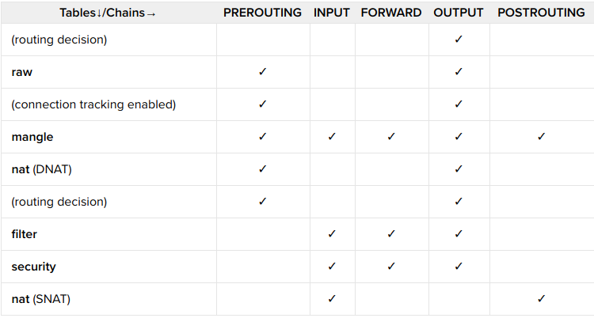
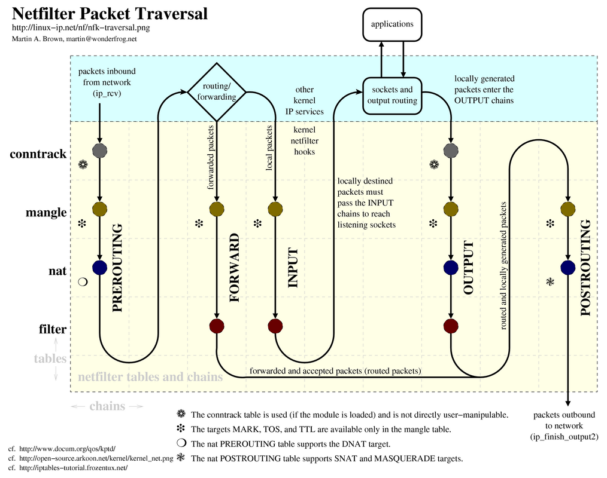

# Iptable

## Netfilter
Là phần mềm lọc gói, dịch địa chỉ mạng (và cổng) (NAT, Port fowarding). Là tập hợp các hook bên trong kernel Linux, cho phép các mô-đun kernel đăng ký các hàm gọi lại với ngăn xếp mạng.
Để giao tiếp với Netfilter, người ta thường sử dụng IPtables.

Netfilter Hooks
Có 5 loại Hook khác nhau

* `NF_IP_PER_ROUNTING` - được gọi khi một gói đến máy
* `NF_IP_LOCAL_IN` - được gọi khi một gói gửi đến chính máy đó
* `NF_IP_FORWARD` - Hook này được gọi khi gói được chuyển đến interface khác.
* `NF_IP_LOCAL_OUT` - được gọi khi một gói tin được tạo cục bộ và được định sẵn.
* `NF_IP_POST_ROUTING` - được gọi khi một gói đang trên đường trở về mạng bên ngoài hệ thống.

## Khái niệm IPtable

Tất cả các dữ liệu được gửi đi trong các gói tin được định dạng qua internet. Linux kernel cung cấp một giao diện iptables là một ứng dụng dòng lệnh giao tiếp với kernel thông qua netfilter và là một bức tường lửa Linux mà bạn có thể sử dụng để thiết lập, duy trì để lọc các gói tin đi vào và đi ra sử dụng một bảng các bộ lọc gói tin. Và kiểm tra các bảng này. 

Trước iptables, các chương trình quản lý tường lửa trên Linux là `ipchains` trên Linux 2.2; `ipfwadm` trên Linux 2.0 dựa trên chương trình `ipfw` trên BSD

Iptables có khả năng giám sát trạng thái của kết nối và chuyển hướng, thay đổi hay dừng các gói tin dựa trên trạng thái kết nối, không chỉ dựa vào nguồn, đích hay nội dung gói tin. Iptables có thể nhận thức được ngữ cảnh gói tin đang di chuyển, từ đó ra quyết định đúng đắn hơn cho các gói tin và kết nối.

Iptables cho phép người quản trị hệ thống định nghĩa các bảng (table) chứa các chuỗi (Chains) luật (rules) áp dụng cho gói tin. Mỗi bảng tương ứng với một loại của quy trình gói tin. Các gói tin được xử lý nối tiếp qua từng luật trong chuỗi.
Mỗi luật trong một chuỗi có thể đổi hướng hay nhảy đến một chuỗi khác, và quá trình này tiếp diễn đến khi vòng lặp kết thúc.

Bạn có thể thiết lập nhiều bảng (table) khác nhau, mỗi bảng có thể chứa nhiều chuỗi(chain), mỗi một chuỗi là một bộ quy tắc(rule). Mỗi quy tắc định nghĩa phải làm gì với gói tin nếu nó phù hợp với gói đó(target).

Các thành phần chính bao gồm `Table`, `chain`, `target`

*chain*

Bảng bộ lọc (filter) có 5 chuỗi quy tắc (còn gọi là `chain`) ánh xạ đến 5 móc nối (hook) trong Netfilter

* PREROUTING - thay đổi gói tin khi chúng vào (thường dùng cho DNAT).
* INPUT - được sử dụng để điều khiển các gói tin đến tới máy chủ. Bạn có thể chặn hoặc cho phép kết nối dựa trên cổng, giao thức hoặc địa chỉ IP nguồn.
* FORWARD - được sử dụng để lọc các gói dữ liệu đến máy chủ nhưng sẽ được chuyển tiếp ở một nơi khác.
* OUTPUT - được sử dụng để lọc các gói tin đi ra từ máy chủ của bạn
* POSTROUTING - thay đổi các gói tin khi chúng sắp ra (thường dùng cho SNAT)

*table*

iptables đi kèm với 3 bản dựng sẵn để định nghĩa các rules cho gói tin.

|bảng| mô tả |
|----|-------|
|nat|được sử dụng theo dõi kết nối để chuyển hướng kết nối mạng (NAT) thường dựa trên địa chỉ nguồn hoặc đích. Tích hợp với nó là `output`, `postrouting`, `prerouting`|
|filter|Được sử dụng để đặt chính sách cho loại lưu lượng được phép vào, đi qua và ra máy tính. Tích hợp với `forward` `input` và `output`|
|mangle|Bảng quyết định sửa header gói tin (các giá trị trường TTL(time to live), MTU,... Tích hợp với `forward` `input` `output` `postrouting` và `prerouting`|
|raw|raw table cung cấp một cơ chế đánh dấu các gói để từ chối theo dõi kết nối.|
|security|Được sử dụng để thiết lập SELinux dấu bối cảnh an ninh nội bộ về các gói mà sẽ ảnh hưởng đến SELinux áp dụng trên từng gói và từng kết nỗi.|

*target*
 
Khi một gói tin được xác định, nó sẽ đưa ra một TARGET. Mội target (mục tiêu) có thể là mỗi chuỗi khác để khớp với một trong các giá trị đặc biệt sau đây:

* ACCEPT: gói tin sẽ được phép đi qua
* DROP: gói tin sẽ không được phép đi qua
* QUEUE: Gói tin được xếp vào hàng đợi
* RETURN: bỏ qua chuỗi hiện tại và quay trở lại quy tắc tiếp theo từ chuỗi mà nó được gọi.

### Quá trình xử lý gói tin

## Quét cổng
* Quét cổng là phương pháp để xác định những cổng trên một mạng lưới được mở. Vì các cổng trên máy tính là nơi gửi và nhận thông tin. 
* Các cổng khác nhau trong các dịch vụ được cung cấp. Chúng được đánh số từ 0 đến 65535. 
- Các cổng từ 0-1023 được xác định là các cổng tiêu chuẩn hay Well Known Ports và được Cơ quan cấp số internet (IANA) chỉ dịch vụ.
- Các cổng từ 1024 - 49151 được gọi là Registered Ports
- Các cổng từ 49152 – 65535 được gọi là Dynamic Ports
* Các kỹ thuật quét cổng cơ bản mà các phần mềm quét cổng có khả năng gồm:

- Vanilla - (cơ bản nhất) kết nối với 65536 cổng một lần. Gửi cờ SYN (yêu cầu kết nối) và khi nhận được cờ phản hồi SYN-ACK(xác nhận kết nối) sẽ gửi lại cờ ACK (Bao gồm một bắt tay TCP). Đây là cách quét đầy đủ và chính xác nhưng dễ bị phát hiện bởi firewall vì các kết nối đầy đủ luôn được ghi lại
- Quét SYN - (Quét nửa mở) chỉ gửi một SYN và chờ phản hồi của SYN-ACK từ mục tiêu nhưng k gửi lại ACK. Vì kết nối TCP chưa hoàn thành nên hệ thống không ghi nhật ký tương tác nhưng người gửi vẫn biết đươc cổng có mở hay không
- XMAS và FIN Quét - một ví dụ về bộ quét được sử dụng để thu thập thông tin mà không được hệ thống đích ghi lại. Trong quá trình quét FIN, cờ FIN không được yêu cầu (được sử dụng bình thường để kết thúc phiên đã thiết lập) sẽ được gửi đến một cổng. Phản ứng của hệ thống đối với cờ ngẫu nhiên này có thể tiết lộ trạng thái của cổng hoặc thông tin chi tiết về tường lửa. Ví dụ, một cổng đóng nhận gói FIN không được yêu cầu, sẽ phản hồi với gói RST (hủy bỏ tức thời), nhưng một cổng mở sẽ bỏ qua nó. Quét XMAS chỉ cần gửi một tập hợp tất cả các cờ, tạo ra một tương tác vô nghĩa. Phản ứng của hệ thống có thể được diễn giải để hiểu rõ hơn về cổng và tường lửa của hệ thống.
- FTP Bounce Scan - cho phép ngụy trang vị trí của người gửi bằng cách trả lại gói thông qua máy chủ FTP. Điều này cũng được thiết kế để người gửi không bị phát hiện.
- Sweep scan - ping cùng một cổng trên một số máy tính để xác định máy tính nào trên mạng đang hoạt động. Điều này không tiết lộ thông tin về trạng thái của cổng, thay vào đó nó cho người gửi biết hệ thống nào trên mạng đang hoạt động. Vì vậy, nó có thể được sử dụng như một bản quét sơ bộ.

* Các trạng thái của cổng
Có 6 trạng thái của cổng ` open, closed, filtered, unfiltered, open|filtered, hoặc closed|filtered.`
- Open : Một ứng dụng đang tích cực chấp nhận các kết nối TCP, datagram UDP hoặc SCTP trên cổng này. Tìm kiếm những thứ này thường là mục tiêu chính của quét cổng. Những người có đầu óc bảo mật biết rằng mỗi cổng mở là một con đường để tấn công. Kẻ tấn công và người kiểm tra bút muốn khai thác các cổng mở, trong khi các quản trị viên cố gắng đóng hoặc bảo vệ chúng bằng tường lửa mà không cản trở người dùng hợp pháp. Các cổng mở cũng thú vị đối với các bản quét không bảo mật vì chúng hiển thị các dịch vụ có sẵn để sử dụng trên mạng.
- Close: Một cổng đóng có thể truy cập (nó nhận và trả lời các gói thăm dò Nmap), nhưng không có ứng dụng nào nghe trên đó. Chúng có thể hữu ích trong việc hiển thị rằng một máy chủ lưu trữ trên một địa chỉ IP (phát hiện máy chủ hoặc quét ping) và là một phần của phát hiện hệ điều hành. Vì các cổng đóng có thể truy cập được, nên có thể đáng để quét sau trong trường hợp một số mở ra. Quản trị viên có thể muốn xem xét việc chặn các cổng như vậy bằng tường lửa. Sau đó, chúng sẽ xuất hiện trong trạng thái được lọc, thảo luận tiếp theo.
- filtered: Nmap không thể xác định xem cổng có mở hay không vì lọc gói ngăn chặn các đầu dò của nó tiếp cận cổng. Việc lọc có thể từ một thiết bị tường lửa chuyên dụng, quy tắc bộ định tuyến hoặc phần mềm tường lửa dựa trên máy chủ. Những cổng này làm nản lòng những kẻ tấn công vì chúng cung cấp rất ít thông tin. Đôi khi, họ phản hồi bằng các thông báo lỗi ICMP, chẳng hạn như mã 3 loại 13 (không thể truy cập đích: truyền thông bị cấm về mặt hành chính), nhưng các bộ lọc chỉ đơn giản là bỏ đầu dò mà không phản hồi thì phổ biến hơn nhiều. Điều này buộc Nmap phải thử lại nhiều lần chỉ trong trường hợp đầu dò bị hủy do tắc nghẽn mạng thay vì lọc. Điều này làm chậm quá trình quét đáng kể.
- unfiltered: Trạng thái chưa được lọc có nghĩa là một cổng có thể truy cập được, nhưng Nmap không thể xác định xem nó là mở hay đóng. Chỉ quét ACK, được sử dụng để ánh xạ các quy tắc tường lửa, phân loại các cổng vào trạng thái này. Quét các cổng chưa được lọc bằng các loại quét khác như quét Window, quét SYN hoặc quét FIN, có thể giúp giải quyết xem cổng có mở không
- open|filtered: Nmap đặt các cổng ở trạng thái này khi không thể xác định xem một cổng được mở hay được lọc. Điều này xảy ra đối với các kiểu quét trong đó các cổng mở không có phản hồi. Việc thiếu phản hồi cũng có thể có nghĩa là bộ lọc gói đã bỏ đầu dò hoặc bất kỳ phản hồi nào mà nó gợi ra. Vì vậy, Nmap không biết chắc chắn rằng cổng đang mở hay đang được lọc. Giao thức UDP, IP, FIN, NULL và Xmas phân loại các cổng theo cách này.
- close|filtered: Trạng thái này được sử dụng khi Nmap không thể xác định xem một cổng được đóng hay lọc. Nó chỉ được sử dụng để quét IP ID nhàn rỗi.

