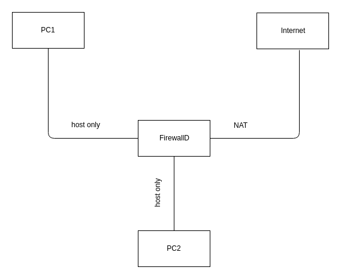

# Firewalld

Firewalld cung cấp một tường lửa được quản lý động với sự hỗ trợ cho các vùng mạng / tường lửa xác định mức độ tin cậy của các kết nối hoặc giao diện mạng. Nó có hỗ trợ cho IPv4, cài đặt tường lửa IPv6, cầu nối ethernet và bộ IP. Có một sự tách biệt giữa thời gian chạy và các tùy chọn cấu hình vĩnh viễn. Nó cũng cung cấp giao diện cho các dịch vụ hoặc ứng dụng để thêm các quy tắc tường lửa trực tiếp.

Firewalld là một dịch vụ động lập nhưng cũng giống như dịch vụ iptables, cả hai đều là giao diện người dùng cho khung lọc gói netfilter bên trong nhân Linux. Firewalld là một giao diện người dùng đơn giản hơn để giúp giao tiếp với iptables-command. Bạn không nên kích hoạt cả iptables và firewalld vì nó sẽ gây xung đột.

File cấu hình hệ thống của firewalld nằm trong `/usr/lib/firewalld/*` 
File cấu hình cho ngươid dùng ở `/etc/firewalld/*`

Các tính năng cở bản:
* API D-Bus hoàn chỉnh
* Hỗ trợ IPv4, IPv6, cầu nối ipset
* Hỗ trợ NAT IPv4 và IPv6
* Zone firewall
* Danh sách zone, dịch vụ icmptypes được xác định trước
* Dịch vụ đơn giản, cổng, giao thức, cổng nguồn, giả mạo, chuyển tiếp cổng, bộc lọc icmp, quy tắc phòng phú, giao diện và địa chỉ nguồn handlig trong các vùng
* Địng nghĩa dịch vụ đơn giản với các cổng, giao thức, cổng nguồn, modul và xử lý địa chỉ đích.
* Ngôn ngữ phong phú cho các quy tắc linh hoạt và phức tạp hơn trong khu vực
* Thời gian quy tắc tường lửa trong khu vực
* Nhật ký đơn giản của các gói bị từ chối
* Giao diện trực tiếp
* Khóa cứng: Làm trắng các ứng dụng có thể sửa đổi tường lửa
* Tự động tải các module hạt nhân linux
* Tích hợp với con rối
* Gợi ý dòng lệnh cho cấu hình trực tuyến và ngoại tuyến
* Công cụ cấu hình đồ họa bằng gtk3
* Ứng dụng sử dụng Qt4
## 1. Khái niệm cơ bản trong Firewalld

### 1.1 Zones
Deamon `firewall` quản lý các nhóm quy tắc bằng cách sử dụng các thực thể được gọi là "zones". Zones là bộ quy tắc đơn giản quyết định traffic nào nên được cho phép tùy thuộc vào mức độ tin cậy bạn có trong các mạng mà máy tính của bạn được kết nối. Các giao diện mạng được gắn một zone để quyết định hành vi mà firewall sẽ cho phép.

Theo thứ tự từ **least trusted** đến **most trusted**, các vùng được xác định trước trong firewalld là:

* **Drop**: Mức độ tin cậy thấp nhất. Tất cả kết nối đến đều bị ngắt mà không trả lời . (Drop incoming) 
* **block**: Tương tự như ở trên, nhưng thay vì đơn giản là bỏ các kết nối, các yêu cầu gửi đến bị từ chối với một thông báo cấm icmp-host-prohibited hoặc icmp6-adm-prohibited. (Reject incoming)
* **public**: Đại diện cho các mạng công cộng, không đáng tin cậy. Bạn không tin tưởng các máy tính khác nhưng có thể cho phép các kết nối đến được chọn trên cơ sở từng trường hợp cụ thể. (Reject incoming) (ssh; dhcpv6-client)
* **external**: Mạng bên ngoài trong trường hợp bạn sử dụng firewall làm cổng của mình. Nó được cấu hình để NAT giả mạo mạng nội bộ của bạn vẫn ở chế độ riêng tư nhưng có thể truy cập được. (Reject incoming) (ssh; hỗ trợ forward port)
* **internal**: Mặt khác của vùng bên ngoài, được sử dụng cho phần bên trong của cổng. Các máy tính khá đáng tin và một số dịch vụ bổ sung có sẵn. (Reject incoming) (ssh; mdns; samba-client; dhcpv6-client)
* **dmz**: Được sử dụng cho các máy tính nằm trong DMZ (các máy tính bị cô lập sẽ không có quyền truy cập vào phần còn lại của mạng của bạn). Chỉ cho phép một số kết nối đến. (Reject incoming) (ssh)
* **work**: Được sử dụng cho các máy làm việc. Tin tưởng hầu hết các máy tính trong mạng. Một vài dịch vụ khác có thể được cho phép. (Reject incoming) (ssh; dhcpv6-client)
* **home**: Một môi trường nhà riêng. Nó thường ngụ ý rằng bạn tin tưởng hầu hết các máy tính khác và một vài dịch vụ khác sẽ được chấp nhận. (Reject incoming) (ssh; mdns; samba-client; dhcpv6-client)
* **trusted**: Tất cả các kết nối mạng được chấp nhận. (allow all incoming)

Để sử dụng firewall, chúng ta có thể tạo các quy tắc và thay đổi các thuộc tính của các zone và sau đó gán các giao diện mạng của chúng ta cho bất kỳ zone nào thích hợp nhất. Một zone có thể có nhiều network interface, một network interface chỉ có một zone. Có loại `outgoing`  `incoming`

### 1.2 Hiệu lực của các rule

Trong FirewallD, các quy tắc được cấu hình thời gian hiệu lực Runtime hoặc Permanent.

Runtime(mặc định): có tác dụng ngay lập tức, mất hiệu lực khi reboot hệ thống.
Permanent: không áp dụng cho hệ thống đang chạy, cần reload mới có hiệu lực, tác dụng vĩnh viễn cả khi reboot hệ thống.

### 1.3 Service
Việc sử dụng các dịch vụ được xác định trước giúp người dùng dễ dàng kích hoạt và vô hiệu hóa quyền truy cập vào một dịch vụ.
## 2. Cài đặt
**Với RHEL, CentOS & Fedora**
`firewalld` được cài đặt theo mặc định của một số bản phân phối Linux. Tuy nhiên có thể cài đặt firewalld bằng lệnh
```
yum install firewalld firewall-config
```
Kích hoạt dịch vụ 
```
systemctl enable firewalld
```
Chúng ta có thể xác minh rằng dịch vụ đang chạy và có thể truy cập bằng cách nhập:
```
firewall-cmd --state
```
```
output
running
```

**Với Ubuntu**
Trước tiên bạn phải xóa UFW và cài gói `firewall-applet`

```
apt-get remove ufw
apt-get install firewall-applet
```
## 3. Làm quen với các quy tắc firewall
Default zone và các quy tắc được cung cấp bởi `deamon`

### 3.1 Các giá trị mặc định
Chúng ta có thể thấy zone nào hiện được chọn làm mặc định bằng cách gõ:
```
firewall-cmd --get-default-zone
```
> public

Vì chúng ta chưa đặt bất kỳ lệnh `firewalld` nào để chuyển vùng mặc định, và không có interface nào được cấu hình để liên kết với một zone khác, zone đó cũng là zone hoạt động duy nhất. Chúng ta có thể xác minh bằng cách nhập:
```
firewall-cmd --get-active-zones
```
> public interface: ens33

In ra cấu hình của vùng mặc định bằng lệnh:
```
firewall-cmd --list-all
```
```
public (active)
  target: default
  icmp-block-inversion: no
  interfaces: ens33
  sources: 
  services: ssh dhcpv6-client
  ports: 
  protocols: 
  masquerade: no
  forward-ports: 
  source-ports: 
  icmp-blocks: 
  rich rules: 
```
- public (default, active) chỉ ra rằng khu vực công cộng là khu vực mặc định (giao diện mặc định cho khu vực đó khi chúng xuất hiện) và nó đang hoạt động vì có ít nhất một giao diện hoặc nguồn được liên kết với nó.

- interfaces: ens33 liệt kê các giao diện liên quan đến khu vực.

- sources:liệt kê các nguồn cho khu vực. Hiện tại không có, nhưng nếu có, chúng sẽ có dạng xxx.xxx.xxx.xxx/xx.

- services: dhcpv6-client ssh liệt kê các dịch vụ được phép thông qua tường lửa. Bạn có thể nhận được một danh sách đầy đủ các dịch vụ được xác định của tường lửa bằng cách thực thi firewall-cmd --get-services.

- ports:liệt kê các điểm đến cổng được phép thông qua tường lửa. Điều này hữu ích nếu bạn cần cho phép một dịch vụ không được xác định trong tường lửa.

- masquerade: no chỉ ra rằng giả mạo IP bị vô hiệu hóa cho khu vực này. Nếu được bật, điều này sẽ cho phép chuyển tiếp IP, với máy tính của bạn hoạt động như một bộ định tuyến.

- forward-ports: liệt kê các cổng được chuyển tiếp.

- icmp-blocks: một danh sách đen của lưu lượng icmp bị chặn.

- rich rules: cấu hình nâng cao, được xử lý đầu tiên trong một khu vực.

- default là mục tiêu của vùng, xác định hành động được thực hiện trên gói phù hợp với vùng chưa được xử lý rõ ràng bởi một trong các cài đặt ở trên.

Và tất cả đều access outgoing

### 3.2 Zone
Show các Zone hỗ trợ trong `firewalld`
```
firewall-cmd --get-zone
``` 
> block dmz drop external home internal public trusted work

Chúng ta có thể thấy cấu hình cụ thể được liên kết với một vùng bằng cách thêm tham số `--zone=` trong lệnh `--list-all`
```
firewall-cmd --zone=home --list-all
```

Hoặc có thể xuất hết định nghĩa của các vùng bằng lệnh
```
firewall-cmd --list-all-zones
```

## 4. Chọn vùng cho giao diện của bạn

### 4.1 Thay đổi vùng giao diện

Dùng tham số `--zone=` kết hợp với `--change-interface=`
```
firewall-cmd --zone=home --change-interface=ens33
```

### 4.2 Điều chỉnh vùng mặc định
Nếu tất cả giao diện của bạn có thể được xử lý tốt nhất bởi một vùng duy nhất, có thể dễ dàng hơn khi chỉ chọn vùng mặc định tốt nhất và sau đó sử dụng cho cấu hình của bạn.
Bạn có thể thay đổi vùng mặc định bằng tham số `--set-default-zone=`
```
firewall-cmd --set-default-zone=home
```
### 4.3 Đặt quy tắc cho các ứng dụng của bạn
Cách cơ bản để xác định ngoại lệ firewall cho các dịch vụ mà bạn muốn cung cấp có sẵn là dễ dàng.

#### 4.3.1 Thêm dịch vụ vào zone của bạn
Đơn giản nhất là thêm các dịch vụ hoặc cổng bạn cần vào các khu vực bạn đang sử dụng. Một lần nữa, bạn có thể nhận danh sách các dịch vụ có sẵn với tùy chọn `--get-service`
```
firewall-cmd --get-services
```
> RH-Satellite-6 amanda-client amanda-k5-client bacula bacula-client bitcoin bitcoin-rpc bitcoin-testnet bitcoin-testnet-rpc ceph ceph-mon cfengine condor-collector ctdb dhcp dhcpv6 dhcpv6-client dns docker-registry dropbox-lansync elasticsearch freeipa-ldap freeipa-ldaps freeipa-replication freeipa-trust ftp ganglia-client ganglia-master high-availability http https imap imaps ipp ipp-client ipsec iscsi-target kadmin kerberos kibana klogin kpasswd kshell ldap ldaps libvirt libvirt-tls managesieve mdns mosh mountd ms-wbt mssql mysql nfs nrpe ntp openvpn ovirt-imageio ovirt-storageconsole ovirt-vmconsole pmcd pmproxy pmwebapi pmwebapis pop3 pop3s postgresql privoxy proxy-dhcp ptp pulseaudio puppetmaster quassel radius rpc-bind rsh rsyncd samba samba-client sane sip sips smtp smtp-submission smtps snmp snmptrap spideroak-lansync squid ssh synergy syslog syslog-tls telnet tftp tftp-client tinc tor-socks transmission-client vdsm vnc-server wbem-https xmpp-bosh xmpp-client xmpp-local xmpp-server

Sau khi lựa chọn và có thể thêm service bằng lệnh
```
firewall-cmd --zone=public --add-service=ftp
```
Muốn kiểm tra lại và chắc rằng chúng ta đã thành công, chúng ta có thể xác minh bằng `--list-all` hoặc `--list-services`
```
firewall-cmd --zone=public --list-services
```
#### 4.3.2 Điều gì xảy ra khi không có dịch vụ phù hợp?
Các dịch vụ firewall được bao gồm trong cài đặt firewalld đại diện cho nhiều yêu cầu phổ biến nhất cho các ứng dụng mà bạn có thể muốn cho phép truy cập. Tuy nhiên sẽ có thể có các trường hợp các dịch vụ này không phù hợp với yêu cầu của bạn.
Có 2 lựa chọn trong tình huống này
*1 Mở cổng cho zone*
Cách dễ dàng nhất để thêm hỗ trợ cho ứng dụng cụ thể của bạn là mở các cổng mà nó sử dụng trong các vùng thích hợp. Điều này dễ dàng như chỉ định cổng hoặc dải cổng và giao thức liên quan cho các cổng bạn cần mở
```
firewall-cmd --zone=public --add-port=5000/tcp
firewall-cmd --zone=public --add-port=4990-4999/udp
```

*2 Xác định một dịch vụ*
Chúng ta có thể tự định nghĩa dịch vụ của mình trong thư mục `/usr/bin/firewalld/services/` bằng file `.xml`
Ví dụ:
```
/usr/lib/firewalld/services/ssh.xml
<?xml version="1.0" encoding="utf­8"?>
<service>
  <short>SSH</short>
  <description>Secure Shell (SSH) is a protocol for logging into and 
executing commands on remote machines. It provides secure encrypted 
communications. If you plan on accessing your machine remotely via 
SSH over a firewalled interface, enable this option. You need the 
openssh­server package installed for this option to be 
useful.</description>
  <port protocol="tcp" port="22"/>
</service>
```
Sau đó sử dụng lệnh `--add-service=` để add service đó vào zone

### 4.4 Tạo zone
Mặc dù các zone do `firewalld` định nghĩa có thể là quá đủ đối với nhiều người dùng, nhưng vẫn có thể hữu ích khi bạn tự xác định vùng riêng vủa mình và mô tả nhiều hơn về chức năng của chúng.
```
firewall-cmd --permanent --new-zone=example
```
Bây giờ có thể gán các dịch vụ và cổng thích hợp cho vùng của bạn.
```
firewall-cmd --zone=example --add-service=http
```
Sau đó thay đổi interface sang vùng vừa định nghĩa
```
firewall-cmd --zone=example --change-interface=ens33
```
Sau đó phải khởi động lại mạng và tải lại dịch vụ firewall
```
systemctl restart network
systemctl reload firewall
```
## 5. Một số cấu hình nâng cao
Rich rule và Direct Interface cho phép bạn thêm các quy tắc tùy chỉnh hoàn toàn vào bất kỳ zone cho bất kỳ cổng, giao thức, địa chỉ và hành động nào

### 5.1 Rich rule
Có các lệnh cơ bản như
```
--add-rich-rule
--list-rich-rules
--remove-rich-rule
```
Ví dụ như
Cho phép tất cả lưu lượng truy cập IPv4 từ máy chủ 192.168.0.14
```
firewall-cmd --zone=public --add-rich-rule 'rule family="ipv4" source address=192.168.0.40 accept
```
Từ chối lưu lượng IPv4 qua TCP từ máy chủ 192.168.1.10 đến cổng 22
```
firewall-cmd --zone=public --add-rich-rule 'rule family="ipv4" source address="192.168.1.10" protocol=tcp reject'
```
Cho phép lưu lượng truy cập IPv4 qua TCP từ máy chủ 10.1.0.3 đến cổng 80 và chuyển tiếp cục bộ sang cổng 6532
```
firewall-cmd --zone=public --add-rich-rule 'rule family=ipv4 source address=10.1.0.3 forward-port port=80 protocol=tcp to-port=6532'
```
Chuyển tiếp tất cả lưu lượng truy cập IPv4 đến cổng 80 sang cổng 8080 lưu trữ 172.31.4.2 
```
firewall-cmd --zone=public --add-rich-rule 'rule family=ipv4 forward-port port=80 protocol=tcp to-port=8080 to-addr=172.31.4.2'
```

Liệt kê các Rich rule hiện tại
```
firewall-cmd --list-rich-rules
```
### iptables Giao diện trực tiếp
`firewalld` cung cấp giao diện trực tiếp cho phép bạn truyền các lệnh iptables thô cho nó. Quy tắc Direct Interface không liên tục trừ khi `--permanent` được sử dụng.
Để xem tất cả các chuỗi hoặc quy tắc tùy chinh được thêm vào FirewallD

## Một số command khác
Mở một port nào đó.
```
firewall-cmd --add-port=[YOUR PORT]/tcp
```
Quản lý source
```
firewall-cmd --permanent --zone=trusted --add-source=x.x.x.0/24
firewall-cmd --reload
```
Theo MAC
```
firewall-cmd --permanent --zone=trusted --add-source=00:11:22:33:44:55
```

Forward-port
```
# set IP Masquerading
firewall-cmd --zone=external --add-masquerade --permanent 
firewall-cmd --reload 
# ip_forward is enabled automatically if masquerading is enabled.
echo 1 > /proc/sys/net/ipv4/ip_forward 
# example
firewall-cmd --zone=external --add-forward-port=port=22:proto=tcp:toport=1234 
```

Panic Mode: chế độ hoảng loạn là chế độ đặc biệt trong firewall, trong đó tất cả các gói trong và ngoài ràng buộc bị hủy và các kết nối hoạt động sẽ hết hạn sau khi được kích hoạt. Kích hoạt chế độ này trong các tình huống khẩn cấp khi mối đe dọa đối với môi trường mạng của bạn thoát ra.
```
firewall-cmd --query-panic
firewall-cmd --panic-on
# firewall-cmd --panic-off
```

## Lab firewalld

Bài toán 1:



Mục tiêu:
* PC1, PC2 ra được internet
* PC1 và PC2 không liên lạc được với nhau
* PC1 không truy cập được baomoi.com
* Máy ngoài internet có thể truy cập vào PC2 bằng IP cổng ngoài của node firewalld

Mô hình:
PC1: ens33 host-only 172.16.228.130
PC2: ens33 host-only 172.16.8.131
FW: ens33 host-only 172.16.228.129
ens38 host-onnly 172.16.8.132
ens37 nat 172.16.91.134

Trên PC1: thêm default gateway cho máy
```
ip route add default via 172.16.228.129
```
Trên PC2: thêm default gateway cho máy
```
ip route add default via 172.16.8.132
```
Trên Firewall, bật `ip_forward`, bất `masquerade`
```
firewall-cmd --zone=public --add-masquerade
```
Khi gõ lệnh trên đối số trong `/proc/sys/net/ipv4/ip_forwand` sẽ được chuyển thành `1`
Bây giờ PC1 và PC2 đã ra được ngoài mạng và ngoài mạng cũng truy cập được đến PC1 và PC2.

Chặn PC1 không giao tiếp được với PC2
```
firewall-cmd --direct --add-rule ipv4 filter FORWARD 0 -i ens33 -o ens38 -j DROP
```
Chặn PC1 vào website baomoi.com
```
firewall-cmd --direct --add-rule ipv4 filter FORWARD 0 -i ens33 -d 118.102.1.125 -j DROP
```

Forward-port ssh từ ngoài mạng vào máy PC1.

```
firewall-cmd --zone=public --add-forward-port=port=12345:proto=tcp:toport=22:toaddr=172.16.228.130

```