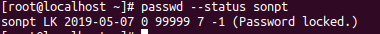

## Vô hiệu hóa đăng nhập người dùng mà không vô hiệu hóa tài khoản
Đây là cách hiển thị mật khẩu được mã hóa thành một chuỗi không hợp lệ bằng cách thêm tiền tố vào chuỗi được mã hóa
* Vô hiệu hóa đăng nhập
```
passwd -l <user>
```
Tuy nhiên với tùy chọn `-l` vẫn có thể đăng nhập bằng các phương thức khác như xác thực khóa chung ssh. Sử dụng lệnh sau để khóa tài khoản đầy đủ `chage -E 0 <user>` lệnh này sẽ cho tài khoản đó hết hạn, nên mọi phương thức đăng nhập vào tài khoản đều không hợp lệ.
Hoặc thay đổi shell mặc định người dùng thành `/sbin/nologin` hoặc `/sbin/false`
* Mở khóa đăng nhập tài khoản (với lệnh passwd -l)
```
passwd -u <user>
```
* Xác minh xem tài khoản bị khoá hoặc vô hiệu hóa
- Kiểm tra xem tài khoản người dùng có bị khóa không
```
passwd --stattus <user>
```
Tài khoản bị khóa sẽ có cờ `LK`



- Kiểm tra nếu tài khoản hết hạn

```
chage -l user
```
- Kiểm tra trường shell của user
```
grep ^<user> /etc/passwd
```
