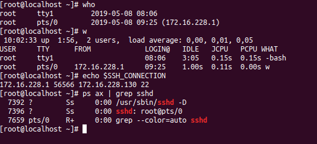

# Check active sesstion
Các lệnh sau chỉ hiển thị và kiểm tra những phiên đăng nhập trên thiết bị đầu cuối. Phiên SSH sẽ nằm trên đầu cuối giả (`pts`) như được hiển thị trong cột `tty`.
`tty` là một thiết bị đầu cuối thông thường (ví dụ như bàn điều khiển trên máy chủ của bạn). 
`pts` là một thiết bị đầu cuối giả (một xterm(SFTP) hoặc một ssh kết nối).
Có nhiều cách để kiểm tra session, dưới đây là một số cách hay dùng

* Sử dụng `who` (hoặc `w`) để check xem những phiên người dùng nào đang hoạt động
* Hay có thể sử dụng cách đơn giản khi bạn đang ở trong một shell giả (vd: /dev/pts/0) là 
```
echo $SSH_CONNECTION
```
* Hay sử dụng `ps ax | grep sshd` để xem các tiến trình nào đang kết nối ssh đến.



* Kiểm tra lịch sử các kết nối ssh bằng cách xem file `sshd.log`
```
cat /var/log/sshd.log
```
* Ngoài ra còn có thể sử dụng `w` để kiểm tra           