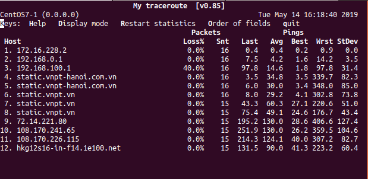
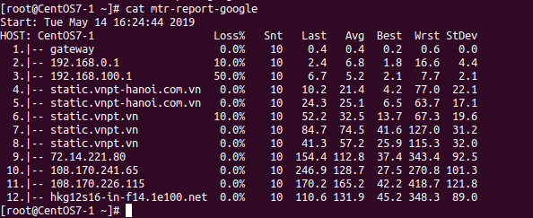

## mtr, traceroute 

### Traceroute
Đánh giá tuyến đường cụ thể mà lưu lượng truy cập mạng đi theo đưa ra một số thách thức khắc phục sự cố. Traceroute sử dụng *time to live* trong giao thức IP để thu hút phản hồi `ICMP TIME_EXCEEDED` từ mỗi cổng dọc theo đường dẫn đến máy chủ đích.

Các option

|command|Ý nghĩa|
|-------|-------|
|-f|Đặt thời gian sống ban đầu được sử dụng trong gói thăm dò đầu tiên|
|-F|Đặt "don't fragment" bit|
|-d|cho phép debug socket|
|-d|Chỉ định một cổng tuyến đường nguồn lỏng|
|-i|Chỉ định giao diện mạng để lấy địa chỉ IP nguồn cho các gói thăm dò đi. Điều này thường chỉ hữu ích trên một máy chủ multi-homed (xem cờ -s để biết cách khác để làm điều này)|
|-I|sử dụng ICMP thay thế cho UDP|
|-m|Đặt thời gian tồn tại tối đa được sử dụng trong các gói thăm dò đi. Mặc định là 30 hops|
|-n|In địa chỉ hop theo số|
|-p|Đặt cổng UDP cơ sở được sử dụng trong các đầu dò (mặc định là 33434)|

### mtr
Là công cụ chẩn đoán mạng dòng lệnh cung cấp chức năng chủa cả hai hệ thống ping và traceroute. Nó là một công cụ đơn giản và đa nền tảng, in thông tin về toàn bộ tuyến đường mà các gói mạng thực hiện, ngay từ hệ thống máy chủ đến hệ thống máy đích được chỉ định. Lệnh mtr chiếm một lợi thế so với traceroute vì nó in tỷ lệ phần trăm phản hồi và thời gian phản hồi cho tất cả các bước nhảy mạng giữa hai hệ thống.

Các command phổ biến
>mtr [tên miền/ip]



* Hiển thị địa chỉ IP số
>mtr -g [tên miền/IP]

* Cả tên máy chủ và địa chỉ IP số

>mtr -b [tên miền/IP]

* Chỉ định giới hạn cho số lượng ping
>mtr -c n [Tên miền/IP]
```
mtr -c 10 google.com
```
* Kích hoạt chế độ báo cáo
>mtr -r -c n [Tên miền/IP] > [tên file]
```
mtr -r -c 10 google.com > mtr-report-goole
```



* Chỉ định khoảng thời gian giữa các yêu cầu ICMP ECHO
>mtr -i [thời gian(s)] [Tên miền/IP]
```
mtr -i 10 google.com
```
* Sử dụng gói TCP SYN hoặc datagram UDP
>mtr --tcp google.com
>mtr --udp google.com
* In đầu ra CSV
>mtr --csv google.com
* In đầu ra XML
>mtr --xml google.com