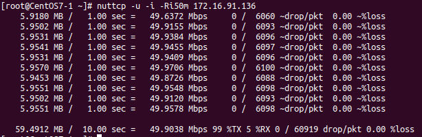
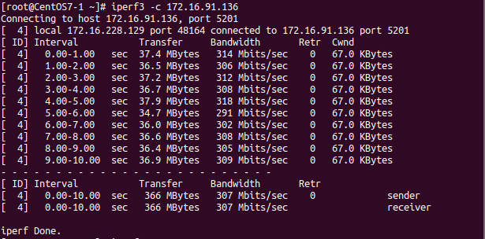

## nuttcp
là công cụ đo lường hiệu suất UCP/TCP đầu cuối.

* Các option
Mode đang phổ biến được sử dụng là client/server. Server sẽ start bằng lệnh `nuttcp -S` (hoặc "nuttcp -1") và sau đó client có thể truyền dữ liệu (sử dụng "nuttcp -t) hoặc nhận dữ liệu (sử dụng "nuttcp -r") từ phía server. Tất cả các thông tin cung cấp bởi nuttcp sẽ được thông báo trên phía client.

|Options|Ý nghĩa|
|-------|-------|
|-t|Chỉ định máy transmitter|
|-r|Chỉ định máy receiver|
|-S|Chỉ định máy server|
|-1|Giống -S|
|-b|Định dạng output theo kiểu one-line|
|-B|Buộc receiver phải đọc toàn bộ buffer|
|-u|Sử dụng UDP (mặc định là TCP)|
|-v|Cung cấp thêm thông tin|
|-w|window size|
|-p|port sử dụng để kết nối dữ liệu, mặc định 5001|
|-P|port kiểm soát kết nối (mode client-server) mặc định 5000|
|-n|Số lượng buffers|
|-N|Số lượng luông dữ liệu truyền|
|-R|Tốc độ truyền|
|-l|Packet length|
|-T|thời gian, mặc định là 10 giây|
|-i|Thời gian gửi báo cáo (giây)|

* Ví dụ

*Server* IP 172.16.91.136
```
nuttcp -S  
```
*Client*
```
nuttcp 172.16.91.136
```
Lệnh trên không gán thêm tham số nào, nó sẽ gửi mặc định các gói TCP trong vòng 10s
Hoặc một trường hơp


Lưu ý rằng% TX và% RX là mức sử dụng cpu trên máy phát và người nhận

```
nuttcp -u -i -Ri50m 172.16.91.136
```
Lệnh này tốt khi dùng để kiểm tra mất gói, nó truyền một luông gói udp 10 giây ở tốc độ 50Mbps. Nó sẽ trình bày các báo cáo khoảng 1 lần 1 giây. Các báo cáo khoảng thời gian và thông lượng cuối cùng không chỉ trình bày thông lượng, mà còn mất gói. Điều quan trọng là đánh giá hạn chế chuỷen UDP để tránh gây ra sự cố mạng với thử nghiệm của bạn.



```
nuttcp -w1m 127.0.0.1
```
Dùng để test tốc độ bên trong host

## iperf3
là một công cụ để đo lường hoạt động của băng thông tối đa có thể đạt được trên các mạng IP. Nó báo cáo băng thông, mất mát gói tin và các tham số khác.
*Tính năng*
* TCP và SCTP
- Đo băng thông
- Báo cáo kích thước MSS/MTU và kích thước đọc quan sát
- Hỗ trợ kích thước cửa sổ TCP thông qua bộ đệm ổ cắm
* UDP
- Máy khách có thể tạo các luồng UDP của băng thông được chỉ định
- Đo mất gói
- Đo độ trễ jitter
- Khả năng đa tuyến

*Lab*
* Server
Bật server ở chế độ lắng nghe bằng cờ `-s`
Có thể sử dụng `-p` để đổi port lắng nghe, không thì sử dụng port mặc định 5201 để lắng nghe.
```
iperf3 -s -p 3000
```
Hoặc có thể cho máy chủ chạy dưới dạng deamon sử dụng cờ `-D` và ghi thông điệp máy chủ vào tệp nhật ký như sau
```
iperf3 -s -D> iperf3log
```
* Client
```
iperf3 -c <ip server> 
```



## bwctl
bwctl là một trình nền chính sách và lập lịch bao bọc iperf, traceroute, owamp và một vài công cụ đo lường khác. Nó hoạt động bằng cách liên hệ với một quá trình bwctl trên hệ thống từ xa và trên hệ thống cục bộ và yêu cầu những trình nền đó thực hiện một thử nghiệm iperf cụ thể giữa chúng.

* Cài đặt
Cài epel rpm
```
yum install epel-release
```
Cài perfSONAR-repo RPM
```
yum install http://software.internet2.edu/rpms/el7/x86_64/main/RPMS/Internet2-repo-0.7-1.noarch.rpm
```
Cài đặt bwctl
```
yum install bwctl
```
* Một số option

|Command|Ý nghĩa|
|-------|-------|
|-4|Chỉ dùng IPv4|
|-6|Chỉ dùng IPv6|
|-c, --receiver|Chỉ định host chạy iperf, iperf3 hoặc nuttcp server|
|-s|Chỉ định host chạy iperf, iperf3 hoặc nuttcp client|
|-T|Chỉ định tool sử dụng|
|-b|Giới hạn băng thông đối với UDP|
|-u|Dùng UDP thay vì TCP|
|-w|Kích thước gói tin đến|
|-tester_port|chỉ định port kết nối|
|-x|Hiển thị output ở cả sender và receiver|

* Lab với `bwctl`
Khá giống với nuttcp và iperf3

Đặt host gửi là sender (server)
```
bwctl -c <ip server>
```
Đặt host nhận là receiver (client)
```
bwctl -s <ip server>
```

Ngoài ra còn một số commnd đi kèm như
```
bwping
bwtraceroute
```

