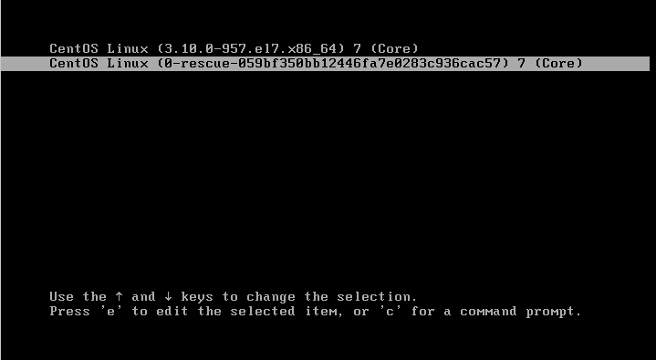
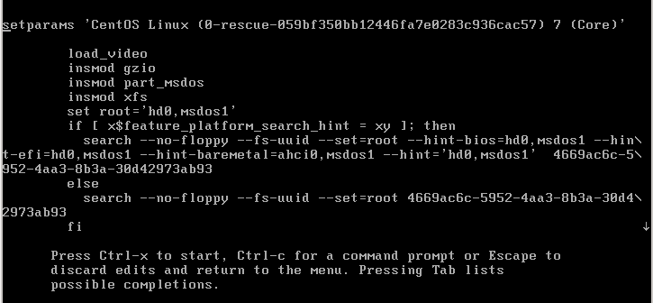
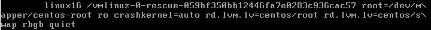

# Set password by Grub

## CentOS 7
Trong phần này tôi sẽ nói về cách để đặt lại mật khẩu root cho máy Centos7 bằng `Grub command`

* Vào màn hình tùy chọn Grub



Điều này được thực hiện bằng cách khởi động lại máy của hoặc bật máy lên khi máy đang tắt. Khi màn hình khởi động CentOS xuất hiện, nhấn `e` để vào menu tùy chọn Grub.oot

* Chỉnh sửa trong tùy chọn grub





Cuộn xuống dòng bắt đầu với `linux` hoặc `linux16`. Thay thế từ `ro` bằng `rw ini=/sysroot/bin/sh`. Sau đó nhấn Ctrl + X để khởi động máy bằng cấu hình vừa cài.

* Truy cập hệ thống tập tin

Sử dụng lệnh `chroot /sysroot`, chúng ta có thể truy cập và thực hiện các lệnh trên hệ thống như đã khởi động vào hệ điều hành. Chúng ta cần làm điều này để truy nhập vào lệnh Passwd của người dùng.

* Thay đổi mật khẩu root

Nhập lệnh `passwd root` để thay đổi mật khẩu root.

* Bước này chỉ cần với SELinux, nếu bạn không sử dụng hoặc đã vô hiệu hóa nó thì bỏ qua bước này.

Bạn cần phải đảm bảo tệp `/etc/shadow` mới được tạo phải chấp nhận là một tệp mới.
```
touch /.autorelabel
```
Sau khi hoàn thành, gõ `exit`, sau đó `exit` lần nữa để. Sau đó `reboot`, sẽ khởi động lâu hơn 1 chút để hệ thống gắn lại nhãn.
Hoàn thành, chúng ta có thể đăng nhập tài khoản root với mật khẩu mới.

## Ubuntu

Tương tự với centOS, nhưng thay bằng lệnh 
```
exec /sbin/init
```
trong grub option.
Khi khởi động lại sử dụng lệnh `passwd` để đổi mật khẩu và `reboot` lại máy. Nếu `reboot` không thành công, sử dụng lệnh `exec /sbin/init` để khởi động lại hệ thống.
