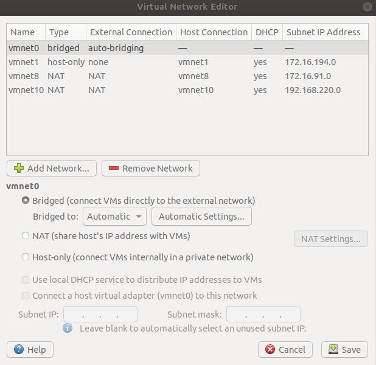
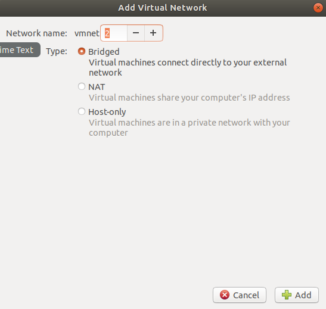
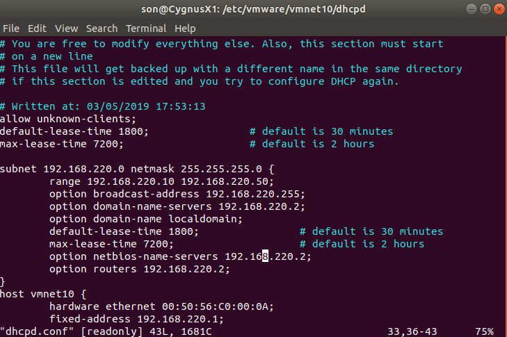
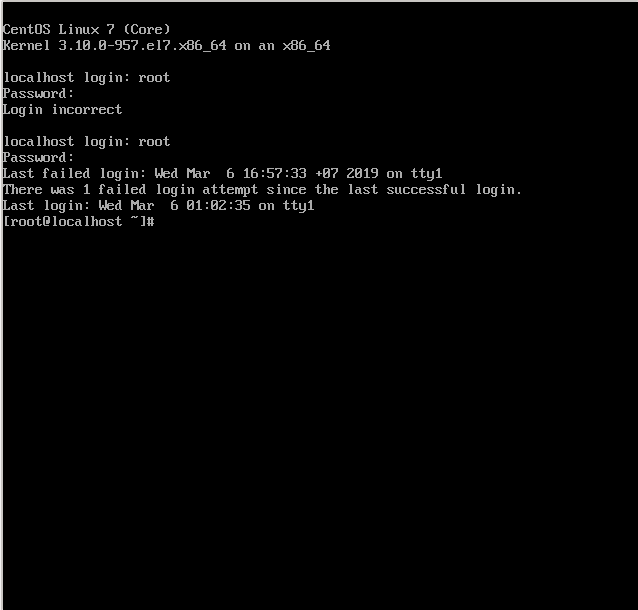
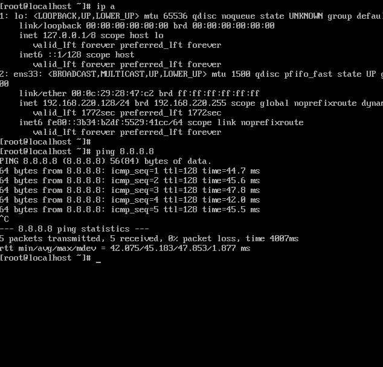
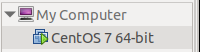
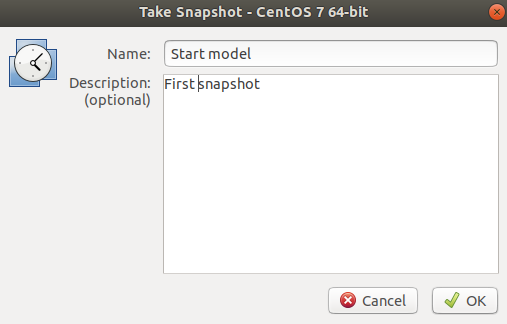
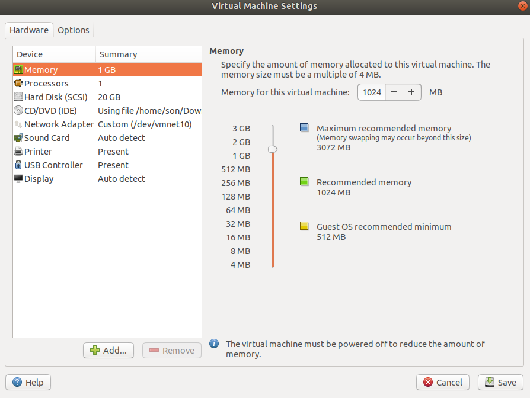
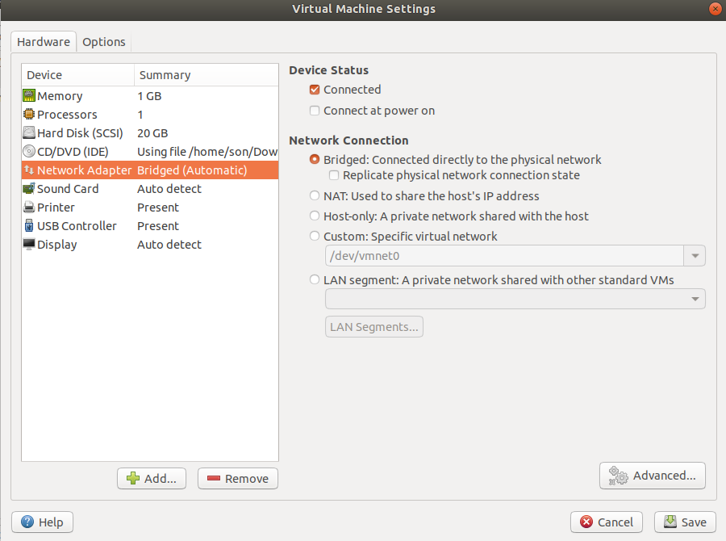

# VMware Workstation Pro 15

1. [Giới thiệu](#Gioithieu)
2. [Các chức năng trong VMware Workstation 15 Pro](#ChucNang)
    * [Các mode network trong VMware](#ModeNet)
    * [Cách thêm và xóa một Network](#AddDele)
    * [Cấu hình DHCP trong VMware](#Dhcp)
    * [Tạo snapshot máy ảo](#Snap)
    * [Kiểm tra và chỉnh sửa cấu hình máy ảo](#KiemTra)
3. [Note](#Note)

## Giới thiệu

**VMware Workstation Pro:** Là phần mềm giúp bạn tạo máy ảo giả lập nhiều hệ điều hành khác nhau một cách dễ dàng, đây được coi như một trong những phần mềm ảo hoá nổi tiếng mạnh nhất trên thế giới hiện nay. Nó được sử dụng rộng rãi cho các doanh nghiệp, công ty, và chiếm số đông người dùng là cá nhân. Mới đây nhân dịp kỷ nhiệm 20 năm thành lập của hãng đội ngủ VMware vừa cho ra mắt phiên bản VMware Workstation 15 Pro mới nhất trong tháng 9/2018.

**VMware Workstation 15 Pro** được cập nhật và có sự thay đổi rất nhiều về hiệu suất đặc biệt là giao diện có sự đột phá mới mẻ với tông màu xanh lá cây chủ đạo. Đây là bản phát hành lớn nhất mà bạn không thể nào bỏ qua. Với VMware bạn có thể tạo riêng một máy ảo ngay trên máy PC nhầm phục vụ cho việc học, kiểm tra virus, các phần mềm độc hại mà không cần phải lo lắng về mức độ an toàn trên máy thật v.v...

## Các chức năng trong VMware Workstation 15 Pro

### Các mode network trong VMware

* **Bridged**

Sao chép một nút mạng khác trên mạng vật lý và máy ảo sẽ nhận được IP của nó (Nếu DHCP được kich hoạt trong mạng)

* **NAT**

Sử dụng ip do máy thật cấp.

* **Hostonly**

Chỉ cho phép hoạt động mạng với hệ điều hành của máy thật.

### Cách thêm và xóa một Network

* Trong VMWare, chọn Edit -> Virtual Network Editor

* Nhấn vào Add Network để thêm một card mạng ảo mới hoặc Remove Network để xóa một card mạng đi. Mặc định sẽ có 3 card là *vmnet0(bridged)*, *vmnet1(hostonly)*, *vmnet8(Nat)*

### Cấu hình DHCP trong VMware

* Trên hệ điều hành ubuntu, VMware pro 15 không có phần DHCP settings trên giao diện Virtual Network Editor. Nên để vào DHCP setting ta vào bằng lệnh trên Cmd theo đường dẫn /etc/vmware/vmnet10/dhcpd/dhcpd.conf

Ở đây xuất hiện các tham số
*subnet* dải địa chỉ IPnet của mạng 
*netmask* Để tìm số bit net của mạng
*range* Dải IP muốn đặt để cấp cho máy ảo
*option broadcast-address* 
*option domain-name-servers* địa chỉ để đẩy thông tin DNS

Khi đã sửa IP subnet và range DHCP chúng ta khởi động máy ảo(tôi dùng Centos7) và đăng nhập vào hệ thống.

Lúc này để muốn ra được mạng internet, chúng ta phải up card mạng trong hệ điều hành lên
**ifup ens33**

sau đó kiểm tra ip **ip a** và ping thử đến 8.8.8.8

### Tạo snapshot máy ảo

* Trong giao diện màn hình chính, chuột phải vào biểu tượng OS trong phần quản lý của My Computer  chọn Snapshot -> Take Snapshot

Đặt tên và mô tả bản snapshot này.

### Kiểm tra và chỉnh sửa cấu hình máy ảo

* chuột phải vào biểu tượng OS  chọn settings

Trong bảng cài đặt này, chú ý đến phần *Network Adapter Custom*

Ở đây chúng ta có thể chuyển đổi card mạng của máy áo. Hoặc chuyển thành Lan Segment với những máy ảo khác trong hệ thống.

### Cấu hình SSH từ máy ảo dùng card mạng Bridged vào máy ảo dùng card mạng Nat

* Chuẩn bị 2 máy ảo một máy có địa chỉ IP 192.168.0.186 dùng Bridged để ra mạng và một máy có địa chỉ IP 192.68.230.129 dùng Nat để ra mạng.
* Mục tiêu: từ máy 0.186 có thể ssh sang máy 230.129 (Sử dụng port forwarding).

    Thêm port forwarding
    

## Note
